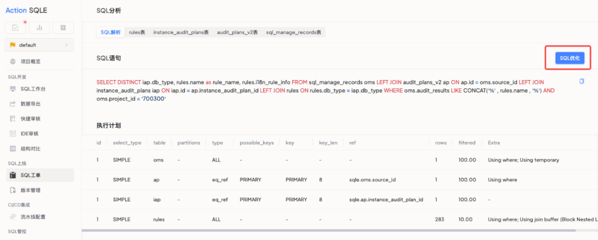
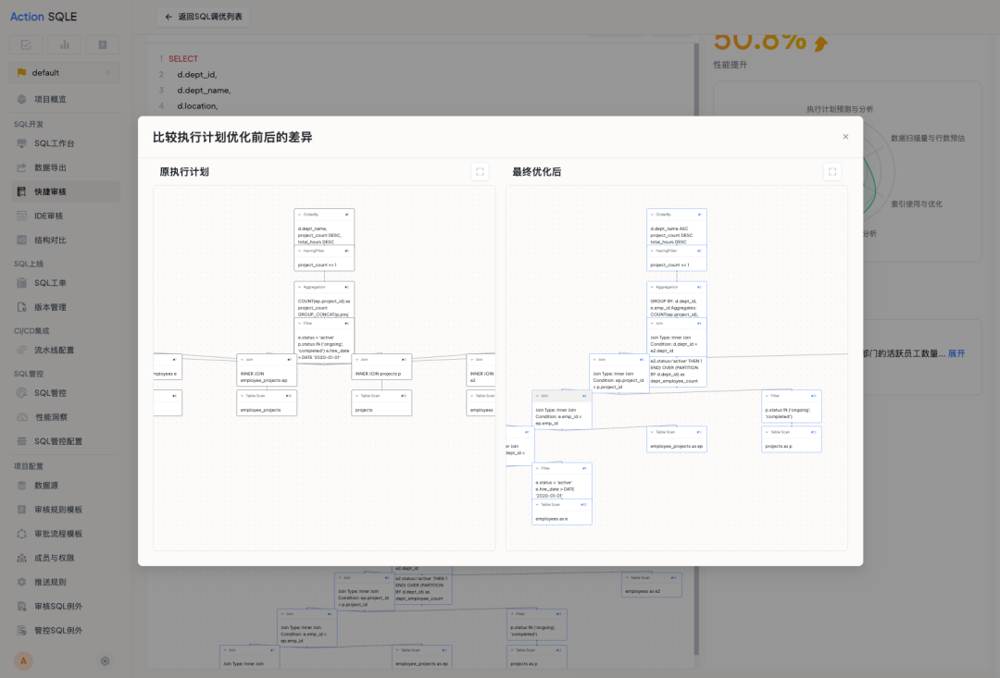

# SQL调优

## 功能概述

### 功能用途

SQL调优功能是SQL性能问题的终结者，通过一键调优让您的查询飞起来！该功能帮助用户快速识别SQL性能瓶颈，并提供智能优化建议，自动改写SQL以提升查询性能。

### 应用场景

- 当您的SQL查询执行缓慢，需要性能优化时
- 当您不确定SQL的执行计划是否最优时
- 当您需要快速获取索引优化建议时
- 当您想了解SQL优化前后的性能差异时

### 主要特点

- **智能分析**：自动分析SQL执行计划，识别性能瓶颈
- **一键调优**：基于分析结果自动提供优化方案，包括SQL重写和索引建议
- **性能对比**：清晰展示优化前后的性能提升百分比
- **执行计划对比**：可视化对比优化前后的执行计划差异
- **SQL对比**：清晰对照优化前后的SQL语句，使改动一目了然
- **优化解读**：每条优化建议都配备详细解释说明，帮助您理解优化原理

### 预期效果

通过SQL调优功能，您可以：
- 显著提升SQL查询性能（如性能提升50%以上）
- 获取专业的索引优化建议
- 理解SQL优化的原理和方法
- 减少数据库资源消耗

## 操作指南

### 功能入口位置

SQL调优功能提供两种入口：

1. **快捷审核入口**：在快捷审核页面，点击"SQL调优"标签页，然后点击右上角的"创建SQL调优"按钮
2. **SQL管控入口**：在SQL管控的SQL分析页面，点击"SQL优化"按钮

### 入口一：从快捷审核创建SQL调优

在快捷审核页面，切换到"SQL调优"标签页，可以看到SQL调优任务列表，包含调优名称、数据源、状态、性能提升百分比、触发调优规则总数、索引总数等信息。

点击右上角的"创建SQL调优"按钮，开始新建调优任务。

### 入口二：从SQL管控进行SQL优化

在SQL管控中，选择需要优化的SQL进行分析，在SQL分析页面点击"SQL优化"按钮即可启动调优。

### 查看优化结果

调优完成后，您可以查看详细的优化结果：

#### 1. 性能提升概览

系统会展示优化后的性能提升百分比，以及优化详情分析，包括：
- 数据扫描量与行数预估
- 执行计划预测与分析
- 索引使用与优化
- SQL复杂度和操作分析

#### 2. SQL优化前后对比

清晰展示优化前后的SQL语句差异，包括：
- 索引优化建议：自动生成创建索引的DDL语句
- SQL重写建议：展示优化后的SQL写法
- 优化说明：详细解释每项优化的原因和效果

#### 3. 执行计划对比

可视化展示优化前后的执行计划差异，帮助您理解优化效果：
- 原执行计划：展示优化前的查询执行路径
- 优化后执行计划：展示优化后的执行路径
- 通过图形化对比，直观了解查询优化的效果

## 调优结果说明

### 性能提升指标

系统通过以下维度评估性能提升：
- **数据扫描量**：优化后减少的数据扫描行数
- **索引使用**：是否有效利用了索引
- **查询复杂度**：SQL结构的简化程度
- **网络传输**：数据传输量的变化

### 优化建议类型

1. **索引优化**：创建合适的索引以加速查询
2. **SQL重写**：优化SQL写法，如：
   - 子查询改写为窗口函数
   - 减少不必要的列查询
   - 优化JOIN顺序
   - 消除冗余操作

## 注意事项

- SQL调优功能需要连接实际数据库才能获取执行计划信息
- 调优建议是基于当前数据库状态和表结构生成的，建议在生产环境应用前进行测试
- 索引建议需要考虑对写入性能的影响，请根据实际业务场景决定是否采纳
- 建议定期对慢查询进行调优分析，持续优化数据库性能
