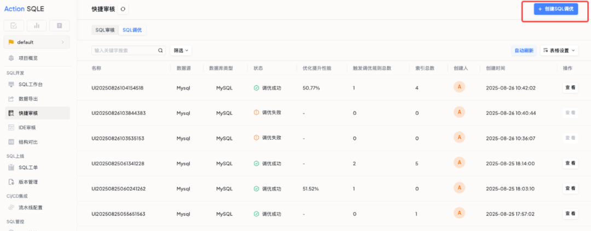
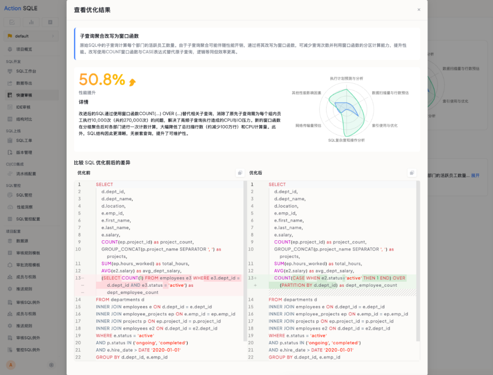
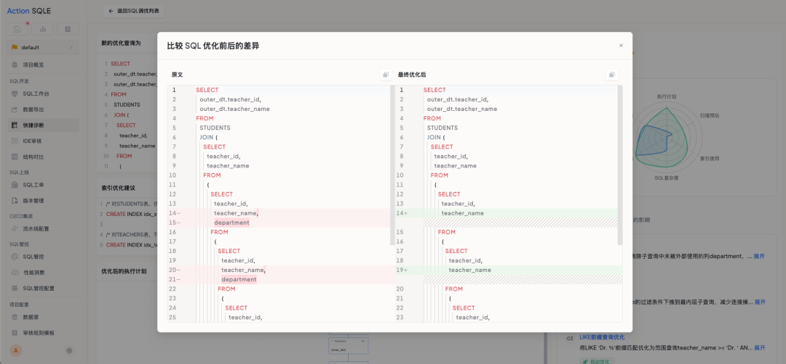
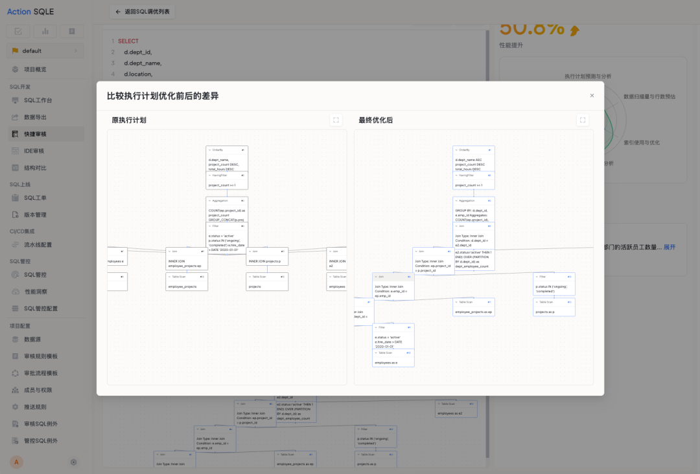

SQL 调优功能通过分析 SQL 执行计划，自动识别性能瓶颈并提供优化建议，包括索引优化和 SQL 改写。

## 适用场景

- SQL 查询执行缓慢，需要性能优化
- 不确定 SQL 执行计划是否最优
- 需要获取索引优化建议
- 希望了解优化前后的性能差异

## 功能入口

| 入口 | 操作路径 |
|------|---------|
| 快捷审核 | 快捷审核页面 → **SQL 调优** 标签页 → **创建 SQL 调优** |
| SQL 管控 | SQL 管控 → SQL 分析页面 → **SQL 优化** |

## 查看优化结果

### 性能提升概览

系统展示优化后的性能提升百分比及详情分析：

- 数据扫描量与行数预估
- 执行计划预测与分析
- 索引使用与优化建议
- SQL 复杂度和操作分析

### SQL 优化前后对比

| 内容 | 说明 |
|------|------|
| 索引优化建议 | 自动生成创建索引的 DDL 语句 |
| SQL 重写建议 | 展示优化后的 SQL 写法（如子查询改写为窗口函数、优化 JOIN 顺序等） |
| 优化说明 | 详细解释每项优化的原因和效果 |

### 执行计划对比

可视化展示优化前后的执行计划差异，直观了解查询优化效果。

:::tip
- SQL 调优需要连接实际数据库获取执行计划信息
- 调优建议基于当前数据库状态生成，建议在生产环境应用前进行测试
- 索引建议需考虑对写入性能的影响
:::
