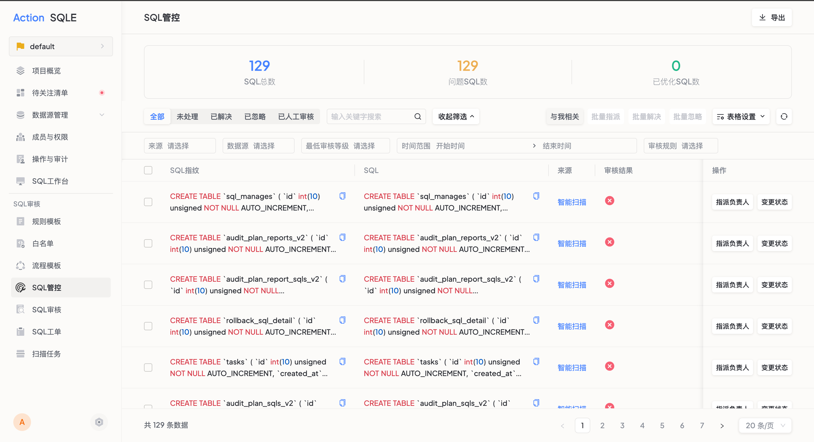

# SQL全生命周期管控

SQL管控页面集中了用户在SQL审核和扫描任务中生成的SQL，方便进行集中的管理。用户可以快速发现审核出问题的SQL，并将其分配给其他成员处理，或将不关心的SQL设为忽略状态，从而实现高效的SQL管理。

## 使用场景

当用户的SQL来源多且分散时，需要将这些SQL集中到一个页面进行管理，以避免遗漏问题SQL，并方便追溯问题SQL的产生及后续解决方式

## 前置条件

用户需要登录平台并生成审核记录，满足以下条件之一：

* 在使用SQL快捷审核时，为SQL附加了审核标签。
* 成功配置了扫描任务并生成了审核记录。

## 使用步骤

用户点击左侧菜单栏的SQL管控标签，进入SQL管控页面。

### SQL筛选

平台提供多种筛选方式，帮助用户快速找到符合条件的SQL：

* SQL来源：根据SQL的来源方式进行筛选，如SQL审核、扫描任务；
* 数据源：根据SQL所属的数据源进行筛选；
* 审核规则等级：根据审核规则的等级进行筛选，如error、warning、notice、normal；
* 时间范围：根据SQL生成的时间范围进行筛选；
* SQL状态：根据SQL的状态进行筛选，如待处理、已解决、已忽略等；
* 与我相关：根据SQL是否与当前用户相关进行筛选，可以选择只显示与当前用户有关的SQL。

### SQL操作

除了展示和过滤SQL，平台还提供多种SQL操作方式，用户可以及时将出现问题的SQL分配给负责人处理，或将其标记为已解决、已忽略或需要人工审核的状态：

* 指派负责人：可以将SQL指派给对应负责人处理；
* 变更状态：可以将表单中的SQL标记为已解决、已忽略或已人工审核的状态；
* 导出：可以根据当前筛选条件导出SQL管控列表的信息。

### 操作结果
通过以上步骤，用户可以使用SQL管控功能集中管理SQL，快速发现问题SQL并进行处理。

