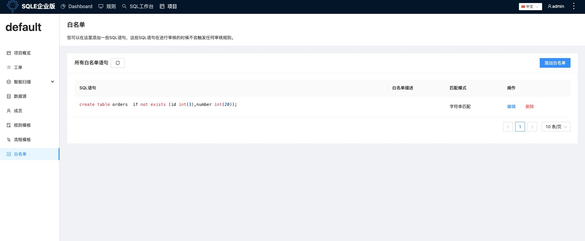
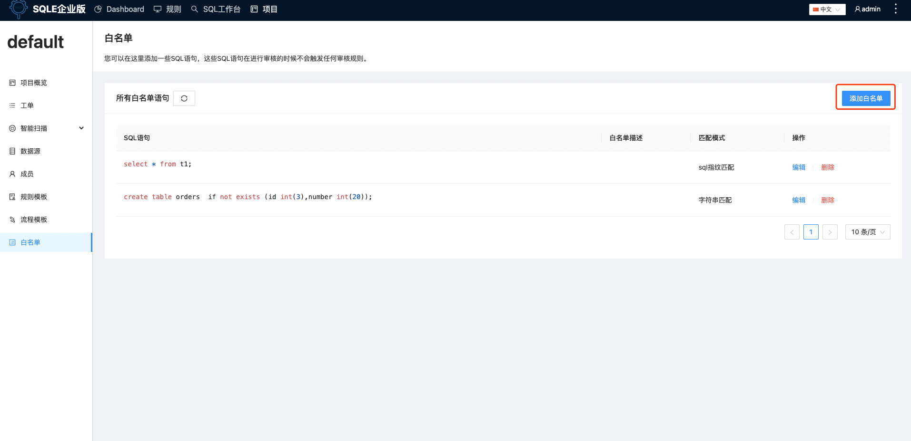

# 白名单【企业版功能】
当我们已知一些 SQL 存在不规范之处，但又想忽略时，可以使用 SQL 白名单功能，添加在SQL审核白名单中的语句，在提交工单申请时，不受审核规则的约束。
:::tip
白名单目前支持两种方式匹配SQL，字符串匹配和SQL指纹匹配，前者需要SQL内容一致，后置匹配同类型的SQL
:::

## 添加白名单
在左侧导航栏的「白名单」标签，查看当前项目中创建的白名单，点击「添加白名单」输入需要跳过sql审核的sql语句，并提交

## 案例
在数据库实例上创建数据库db1，创建表t1，建库和建表语句如下：
```sql
create database db1;
use db1;
create table if not exists t1(id bigint unsigned auto_increment  primary key, c varchar(10) default 'a');
```
对下面的SQL进行审核
```sql
select * from t1;
```
通过审核结果界面可以看到SQL存在审核建议

于是我们在白名单里面添加上这条待审核的SQL

此时，再次提交审核，此时审核建议已经忽略了
