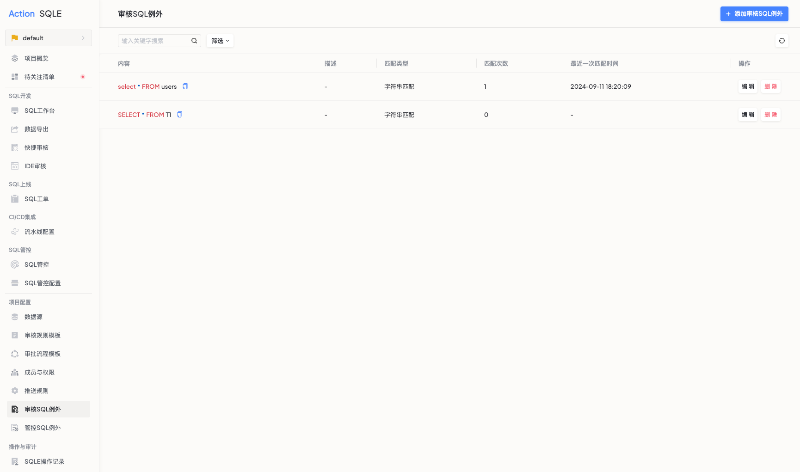

# 白名单【企业版】
本文介绍如何增加、编辑、删除项目中的白名单。
SQLE在企业版中提供白名单功能，便于用户在特定场景下规避具体规则的审核。
添加在SQL审核白名单中的语句，在提交工单申请时，不受审核规则的约束。。
:::tip
白名单目前支持两种方式匹配SQL，字符串匹配和SQL指纹匹配，前者需要SQL内容一致，后置匹配同类型的SQL
:::

### 使用场景
当已知一些 SQL 存在不规范之处，但又想忽略时，可以将SQL语句添加至白名单。

### 前置条件
项目管理员进入指定的项目

### 添加白名单
项目管理员点击左侧导航栏【白名单】菜单，点击白名单列表右上角的【添加白名单】按钮。
* 选择匹配模式：提供以下两种方式
    * 字符串匹配：若选择通过字符串匹配，则将应用于指定SQL语句。
    * SQL指纹匹配：若选择通过SQL指纹匹配，则应用于语句结构一致的SQL。
* 输入白名单描述：用以提示该条白名单SQL的应用场景
* 输入SQL语句

### 执行结果
成功添加白名单后，可以看到当前项目内所有的项目白名单及匹配模式

### 后续步骤
* 创建工单：添加白名单后，可继续创建工单，白名单中的语句将不会触发审核，请参见[工单说明](../project/workflow/intro.md)。
* 创建智能扫描任务：添加白名单后，审核将跳过白名单中的语句，请参见[扫描任务说明](../project/audit_task/intro.md)。
* 
### 更多操作
* 编辑白名单：项目管理员/成员可修改已创建的白名单语句
* 删除白名单：项目管理员/成员可删除已创建的白名单语句

