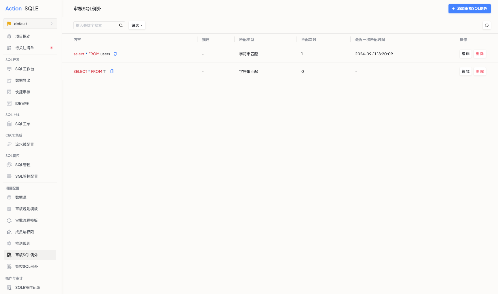
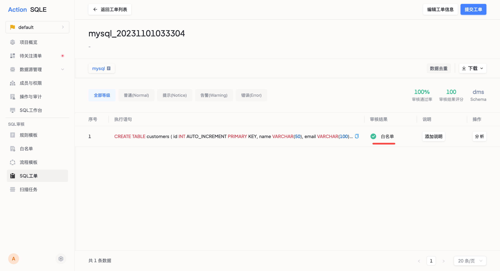

import Edition from '@site/src/components/Edition';

# 审核 SQL 例外 <Edition type="enterprise" />

审核 SQL 例外功能允许将特定 SQL 排除在规则审核之外。当某些 SQL 存在不规范之处但暂时无法修改时，可将其添加为例外，避免反复触发告警。

## 匹配方式

| 方式 | 说明 |
|------|------|
| 字符串匹配 | 精确匹配完整 SQL，包括空格和注释 |
| SQL 指纹匹配 | 按 SQL 结构特征匹配，忽略具体参数值 |

## 操作步骤

### 添加审核 SQL 例外

1. 点击左侧导航栏 **审核 SQL 例外**
2. 点击 **添加审核 SQL 例外** 按钮
3. 选择匹配模式、输入描述和 SQL 语句
4. 提交

### 匹配效果

添加后，审核对应 SQL 时，审核结果中会出现「审核 SQL 例外」提示，不再触发规则告警。

