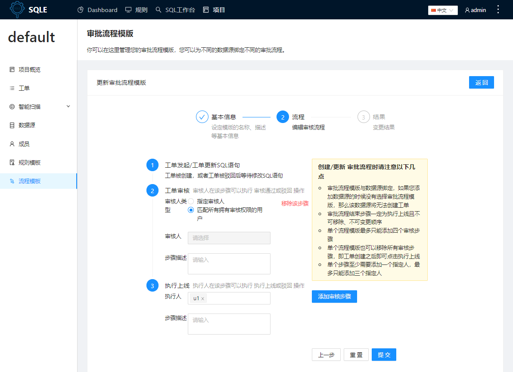

# 流程模版
SQLE 使用工作流来解决 SQL 上线的流程化问题，实现自动审核，自动上线。
:::tip
每个项目对应使用一个流程模版，项目创建后会初始化一个默认模版，用户可根据实际情况调整
:::
## 配置流程模板
点击左侧导航栏的「流程模板」标签，查看项目当前应用的流程模板，点击「修改当前审批流程模板」，修改流程模板相关信息

### 设定模版的基本信息

#### 字段说明
|参数|说明|
|-|-|
|允许创建工单的最高审核等级|选项包括普通、提示、告警、错误四项，如当前设置为告警，则应用这个流程的工单必须所有SQL都没有触发严重于告警级别的规则才可以提交工单|

### 配置审核流程
修改审核流程的各个节点信息

:::tip
工单审核步骤若选择`匹配所有拥有审核权限的用户`时对应的数据源没有对应的人员则默认指定管理员进行审批操作
:::
:::caution
修改流程模版仅对之后的工单有效，之前的工单流程步骤不变
:::