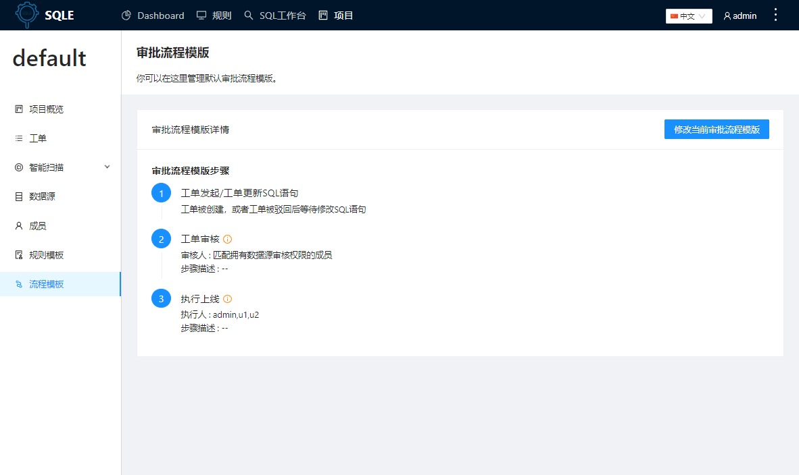

# 流程模版
本文介绍项目中的审核流程模板管理。

DMS平台应用审核流程模板来规范项目内工单审核、上线的流程，项目管理员可配置审核涉及的节点、上线节点，及对应的操作用户。

:::tip
一个项目有且仅有一个审核流程模板。项目创建后会初始化一个默认模版，用户可根据实际情况调整。
:::

:::caution
修改流程模版仅对之后的工单有效，之前的工单流程步骤不变
:::

## 使用场景
一个业务团队中，开发需要在指定数据源上执行SQL，上线的SQL需要符合DBA约定了的安全以及性能规范。因此，DMS为工单场景提供了不同人员之间的协作工作流，即审核流程。

## 前置条件
* 项目管理员进入指定的项目；
* 项目管理员已添加项目成员/成员组；

##  配置审核流程
项目管理员点击左侧导航栏`流程模板`菜单， 点击`修改当前审批流程模板`按钮

### 设定模板的基本信息
设置允许创建工单的最高审核等级

当前提供四种审核等级，包括：
* 普通normal
* 提示notice
* 告警warn
* 错误error

若设置“运行查询的最高审核等级”为告警warn，则审核结果小于等于warn的SQL都可以执行.

### 设置流程节点 
审核流程自工单发起开始，通过设置的审核步骤后，最后以执行上线结束

#### 第一步 工单发起

这一步骤通常指代项目成员创建工单

#### 第二步 工单审核

配置审核节点后，对应审核操作人在该步骤可以执行审核通过或驳回操作

* 选择审核人类型，可以选择指定审核人或匹配拥有数据源审核权限的成员
* 添加步骤描述：用以补充说明步骤信息
* 添加审核步骤：审核流程模板最多可设置4个审核节点，也可不设置审核步骤

:::tip
* 若选择指定审核人
    * 需要项目管理员指定项目成员
    * 最少需要添加一个指定人，最多只能添加三个指定人
    * 指定的审核人可以没有工单审核权限
* 若选择匹配拥有数据源审核权限的成员
    * 将按实例匹配数据源上拥有审核权限的成员
    * 如果创建工单时没有任何用户拥有此数据源工单审核权限, 则项目管理员将会被指定为工单审核人
:::

#### 第三步 工单上线：执行人在该步骤可以执行上线或驳回操作。
* 选择审核人类型，当前提供两种方式：指定上线人或匹配拥有数据源上线权限的成员
* 添加步骤描述

:::tip
* 若选择指定审核人
    * 需要项目管理员指定项目成员
    * 最少需要添加一个指定人，最多只能添加三个指定人
    * 指定的上线人可以没有工单上线权限
* 若选择匹配拥有数据源上线权限的成员
    * 将按实例匹配数据源上拥有上线权限的成员
    * 如果创建工单时没有任何用户拥有此数据源工单上线权限, 则项目管理员将会被指定为工单上线人
:::

#### 第四步 提交审核流程模板
提交审核流程后，流程修改之前创建的工单仍以提交工单时的审核流程执行，流程修改后的创建的工单将以当前的审核流程执行流转。

## 执行结果
提交审核流程模板后，可查看当前设置的审批流程模板涉及的步骤节点，及各步骤的审核人。

## 后续步骤
创建工单：创建审核流程模板后，成员可进入项目中创建工单，请参见：[创建工单](../project/workflow/create-workflow.md)
