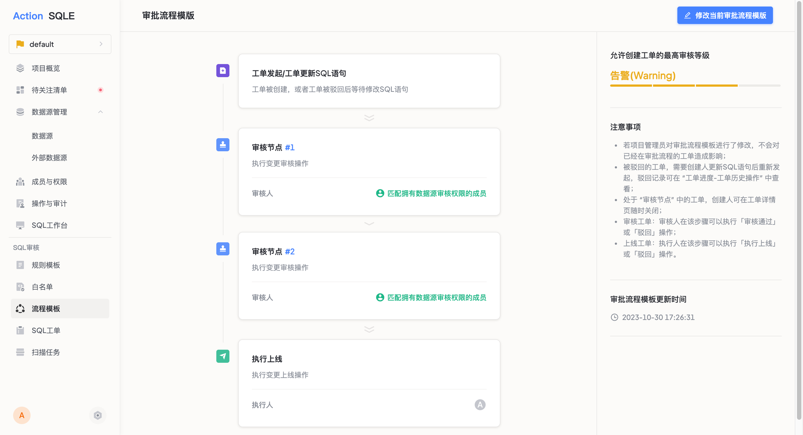

审批流程模板定义了项目内工单从创建到上线的完整流转路径，包括审核节点和上线节点的配置。

:::tip
每个项目有且仅有一个审批流程模板。项目创建后会自动初始化一个默认模板，可根据实际需求调整。
:::

:::caution
修改流程模板仅对之后创建的工单生效，已有工单仍按原流程执行。
:::

## 前置条件

- 当前用户为项目管理员
- 已完成 [成员管理](group_member.md) 配置

## 查看流程模板

点击左侧导航栏 **流程模板**，查看当前项目的审批流程配置。

页面展示流程的各个节点及对应的操作人。

## 配置审批流程

点击 **修改当前审批流程模板** 按钮进入编辑页面。

### 基本设置

| 配置项 | 说明 |
|--------|------|
| 允许创建工单的最高审核等级 | 审核结果不超过该等级的 SQL 允许提交工单。支持 normal / notice / warn / error 四级 |

### 流程节点

审批流程由三类节点组成：

#### 1. 工单发起

项目成员创建工单，流程自动开始。

#### 2. 审核节点（0 ~ 4 个）

每个审核节点需要配置审核人。审核人可以执行 **审核通过** 或 **全部驳回** 操作。

| 配置项 | 说明 |
|--------|------|
| 审核人类型 | **指定审核人**：手动选择 1~3 名项目成员；**匹配权限成员**：自动匹配拥有该数据源审核权限的成员 |
| 步骤描述 | 补充说明该审核环节的职责 |

:::tip
- 选择「匹配权限成员」时，如果没有成员拥有相应权限，项目管理员将被自动指定为审核人
- 审核流程最多支持 4 个审核节点，也可以不设置审核节点直接进入上线环节
:::

#### 3. 上线节点

工单通过所有审核节点后，进入上线环节。上线人可以执行 **上线** 或 **全部驳回** 操作。

| 配置项 | 说明 |
|--------|------|
| 上线人类型 | **指定上线人**：手动选择 1~3 名项目成员；**匹配权限成员**：自动匹配拥有该数据源上线权限的成员 |
| 步骤描述 | 补充说明上线环节的要求 |

### 提交

确认配置后点击 **提交**，流程模板即生效。

## 后续步骤

- [创建工单](workflow/create-workflow.md) — 工单将按照配置的流程模板自动流转
