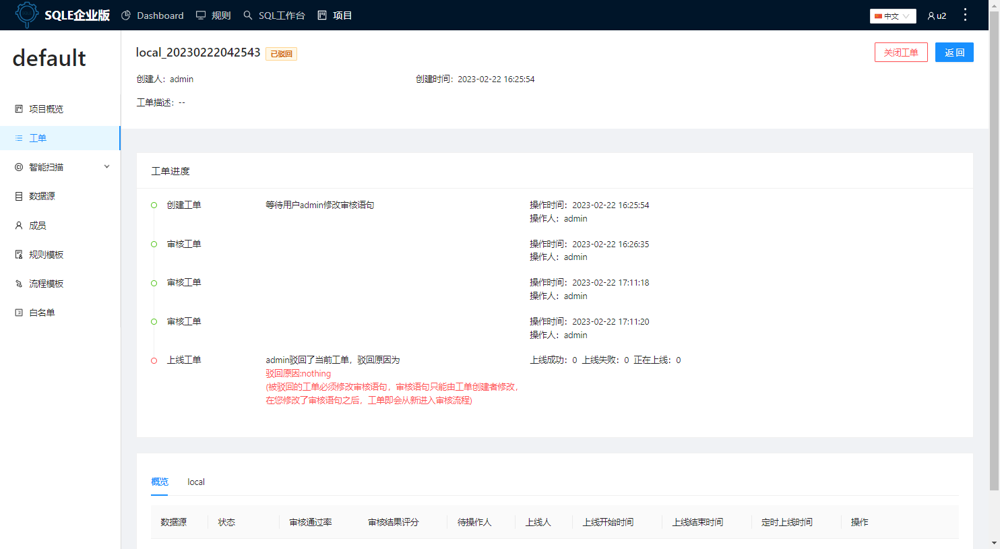

# 审核工单
审核工单包含两部分
* 规则审核：实际生产中，DBA对上线的SQL已有统一的安全、性能规范，则可启用DMS规则模板进行自动审核
* 人工审核：实际生产变化比较大，已有的安全、性能规范很难覆盖所有场景
自动审核通常在创建工单时执行，本节主要介绍人工审核部分。

### 使用场景
实际生产中会存在业务变更、业务上线，比如初始化构建业务库、跑批等，当工单创建后，通常需要审核人员执行审批操作，审批过程中，审批用户可选择审核通过或全部驳回。

### 前置条件
工单已被创建。

### 操作步骤
####  步骤一 查看待审核的工单

* 入口一：您可在dashboard中查看待自己审核的工单
* 入口二：进入项目的工单列表，筛选工单状态为待审核，查看项目内待审核的工单

####  步骤二  点击待审核的工单名称，进入查看工单详情
工单详情页信息包含以下几个方面：

* 工单基础信息：包括工单名称、工单创建人、工单创建时间及工单描述；
* 工单进度：查看当前工单的执行进度，及工单整体流经的流程节点，流程节点与审核流程模板中设置的节点保持一致；
* 工单审核结果查看：
    * 概览：查看工单的整体概况信息，显示工单整体应用的数据源及审核情况
    * 按数据源查看：按数据源查看数据源上的SQL及其审核结果，并查看分析结果，也可下载审核报告、下载SQL语句、去重SQL；

#### 步骤三 审核通过或驳回工单
* 审核通过：成员查看工单详情后，若审核通过，可点击`审核通过`按钮，完成审核；
* 全部驳回：若审核不通过，可点击`全部驳回`按钮，并填写驳回原因，工单将返回至工单创建人处；

### 执行结果
* 审核通过：若点击`审核通过`，工单将按照审核流程模板流转至下一操作节点，状态变更为待审核或待上线；

* 全部驳回：若点击`全部驳回`，工单状态将变更为已驳回，工单进度栏将提示提交的驳回原因，工单将返回至创建人处。

### 后续步骤
* 审核工单：若工单涉及其他审核流程节点，工单将继续流转至下一审核节点审核
* 上线工单：若工单不涉及其他审核流程节点，工单将流转至上线人处执行上线，可参考[上线工单](exec-workflow.md)

