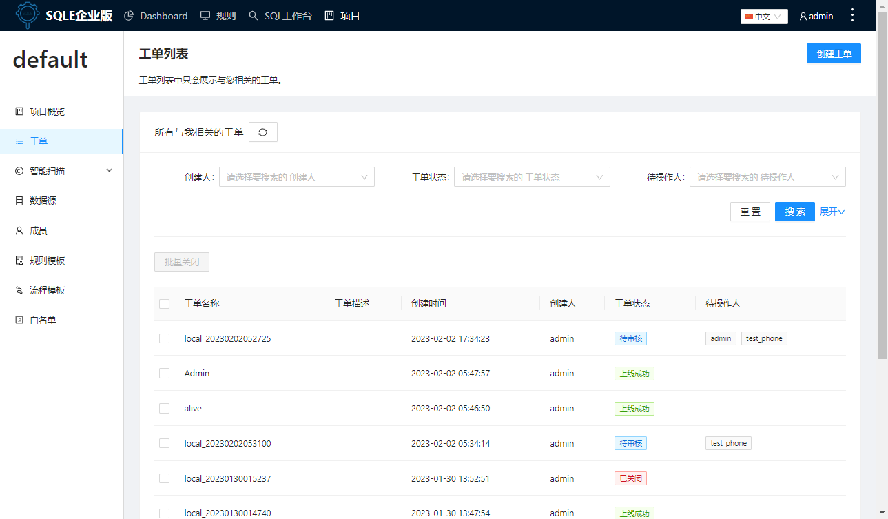
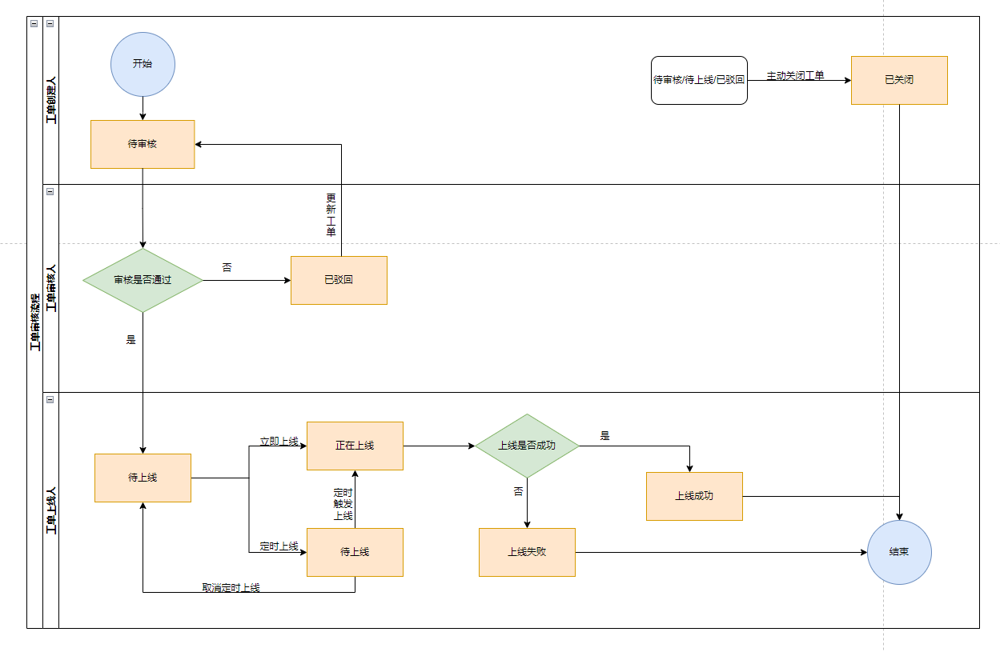
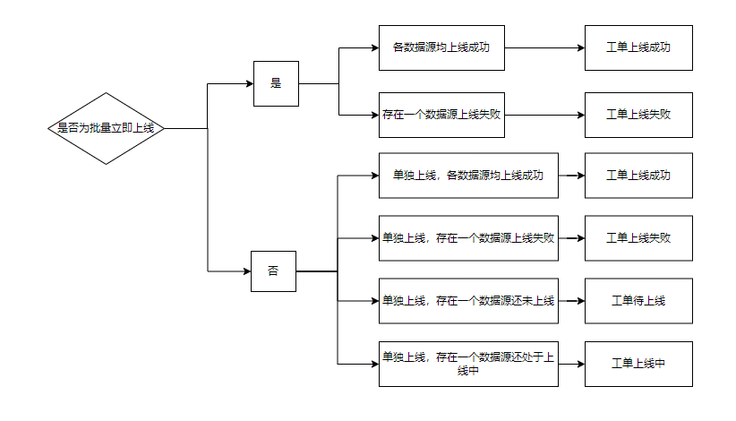
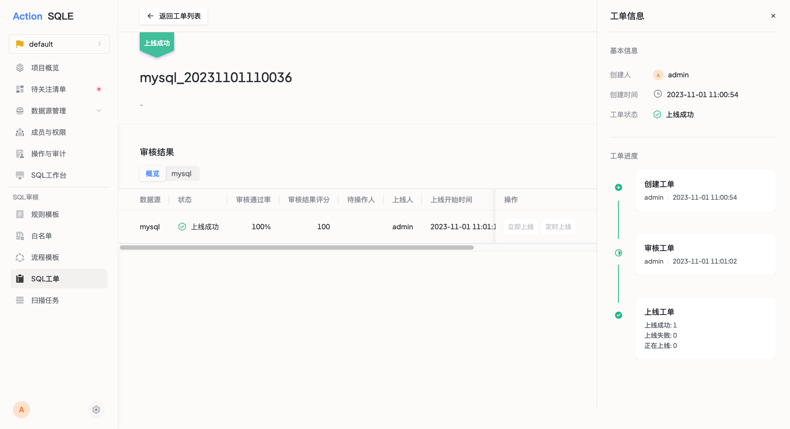
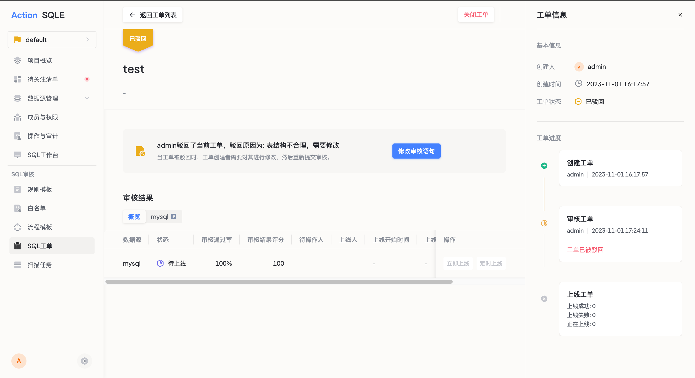

工单创建后，将按审批流程模板的设定自动流转至指定的审核人。审核人查看工单内容后，决定通过或驳回。

## 审核方式

| 类型 | 说明 |
|------|------|
| 规则审核（自动） | 创建工单时由平台自动执行，基于审核规则模板判断 SQL 合规性 |
| 人工审核 | 审核人查看工单详情后做出审核决定，弥补自动规则无法覆盖的场景 |

## 前置条件

- 工单状态为 **待审核**
- 当前用户为该审核节点的指定审核人

## 操作步骤

### 步骤一：查看待审核工单

- **Dashboard**：在首页 Dashboard 的待办区域查看需要自己审核的工单
- **工单列表**：进入项目工单列表，筛选状态为「待审核」

### 步骤二：查看工单详情

点击工单名称进入详情页，包含以下信息：

| 区域 | 内容 |
|------|------|
| 基础信息 | 工单名称、创建人、创建时间、工单描述 |
| 工单进度 | 当前所在流程节点及完整流转路径 |
| 审核结果 | 按数据源查看 SQL 及其审核结果、审核评分、审核报告 |

### 步骤三：审核操作

| 操作 | 说明 |
|------|------|
| **审核通过** | 工单流转至下一节点（下一审核节点或上线节点） |
| **全部驳回** | 工单返回至创建人处，需填写驳回原因 |

## 后续步骤

- 若存在后续审核节点，工单继续流转至下一审核人
- 若所有审核节点已通过，工单进入 [上线环节](exec-workflow.md)
- 驳回后，创建人可修改 SQL 后重新提交工单
