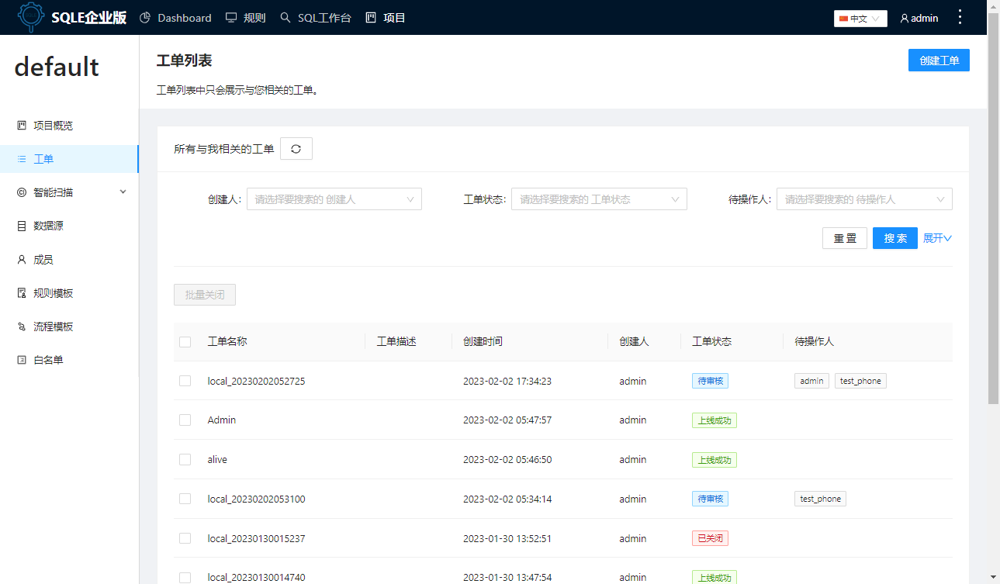

# 创建工单
工单是SQLE提供的在线化SQL上线方式。研发人员可通过创建工单，提请需要审批的SQL语句。

## 使用场景
实际生产中会存在业务变更、业务上线，比如初始化构建业务库、跑批。此时，需要针对某个数据库执行一批SQL。用户可通过SQLE创建工单，输入SQL语句或者上传SQL脚本。

## 前置条件
* 项目管理员已添加数据源；

## 操作步骤
### 步骤一：填写工单基本信息
创建工单前，需要为工单指定唯一的工单名称，并填写工单说明。

* 填写工单名称：
    * 工单名称支持中英文；
    * 若未填写，平台将根据使用的数据源及添加时间组合填充工单名称；
* 填写工单描述：输入工单描述信息，限3000个字符；

### 步骤二：上传SQL语句并审核
需要填写工单中涉及的SQL语句，执行`审核`操作，SQLE会根据数据源配置的审核规则模板，自动进行SQL语句的规则审核，并在线反馈审核结果。
* 选择数据源：表示当前SQL最终会应用到哪个数据源；
    * 社区版：一个工单内仅支持选择一个数据源；
    * 企业版：一个工单内支持添加多个数据源；
* 是否选择相同SQL：当添加多个数据源时，可设置是否选择相同SQL；
    * 使用相同SQL模式，
        * 限制：数据源的数据库类型须相同；
        * 效果：对不同数据源下发相同SQL；
    * 若不使用相同SQL模式
        * 效果：对不同数据源下发不同SQL；
* 选择数据库：选择要执行SQL的数据库，相当于执行 use 语句；
* 选择审核SQL语句上传方式：平台提供四种上传方式，包括在线输入SQL语句、上传SQL文件、上传ZIP文件，配置GIT仓库；
  * 具体区别和使用方法可以参考[SQL审核](../quick_audit.md)中的审核方式一节；
  * 请注意，通过XML文件获取的SQL无法创建工单，因此在SQL工单审核中不再支持XML文件上传方式。
* 点击`审核`，显示平台审核结果；

:::tip
在线输入SQL的场景下，平台支持对输入框中的SQL进行美化，以此提高SQL可读性。

注：当前支持SQL美化的数据源类型包括：
* MySQL
* DB2
* SQL Server
* Oceanbase For MySQL
* Oracle
* PostgreSQL
:::


### 步骤三：查看审核结果

将根据数据源不同，展示不同数据源下的SQL审核结果。
审核结果由以下几部分组成：

* 数据源标签：显示当前SQL操作的数据源，当有多个数据源时，可切换数据源标签，查看不同数据源上的审核情况；
* 数据源上SQL的整体审核通过率、审核结果评分及操作的数据库；
* 数据源上每条SQL的审核结果，包括
  * SQL语句：查看原始SQL
  * 审核结果：查看SQL触发的规则及规则等级；
    * 点击SQL及审核结果栏，可以在右侧抽屉中查看完整信息；
    * 在GIT仓库审核及ZIP文件审核时，可以查看SQL具体的来源路径；
  * SQL分析：企业版用户支持查看SQL分析结果；
* 功能区：
    * 下载审核报告：查看当前数据源下审核的sql语句及其审核结果；
    * 下载SQL语句：下载文件，可查看当前数据源下审核的SQL语句及其审核结果；
    * 设置是否去重：若SQL语句结构一致，去重后将仅显示去重后的SQL；

```jsx title="审核通过率计算方式"
审核通过率=正常sql/sql总数
审核结果等级为notice,warn,err的sql均为非正常sql
```

```jsx title="审核结果评分计算方式"
1.Error以上级别SQL出现率 = Error级别SQL数 / 总SQL数
2.Warn以上级别SQL出现率 = (Error级别SQL数 + Warn级别SQL数) / 总SQL数
3.Warn以上级别SQL出现率 = (Error级别SQL数 + Warn级别SQL数 + Notice级别SQL数) / 总SQL数
4.总分 = 审核通过率 x 30 +
(1 - Error以上级别SQL出现率) x 15 +
(1 - Warn以上级别SQL出现率) x 10 +
(1 - Notice以上级别SQL出现率) x 5 +
(Error以上级别SQL出现概率 == 0 ? 15 : 0) +
(Warn以上级别SQL出现概率 == 0 ? 10 : 0) +
(Notice以上级别SQL出现概率 == 0 ? 5 : 0) +
(Error以上级别SQL出现概率 <0.1 ? 5 : 0) +
(Warn以上级别SQL出现概率 <0.1? 3 : 0) +
(Notice以上级别SQL出现概率 <0.1 ? 2 : 0)

备注: 三元表达式 ==> ( 条件 ? 如果条件为真则为此值 : 如果条件为假则为此值 )
```

### 步骤四：点击创建工单
完成创建后，进入工单列表，即可看到该工单显示为待审核。

## 执行结果
创建工单后，可在工单列表查看已创建的所有工单。


## 后续步骤
* 审核工单：工单创建完成后，将依据审核流程模板的设定，流转至指定的审核成员处，审核成员需登录后进行审核操作，详情可参见[审核工单](audit-workflow.md)。
* 导出工单：当用户需要审计当前已创建的工单时，可选择筛选条件后，点击工单列表的`导出工单`按钮，以csv格式导出满足条件的工单信息。


