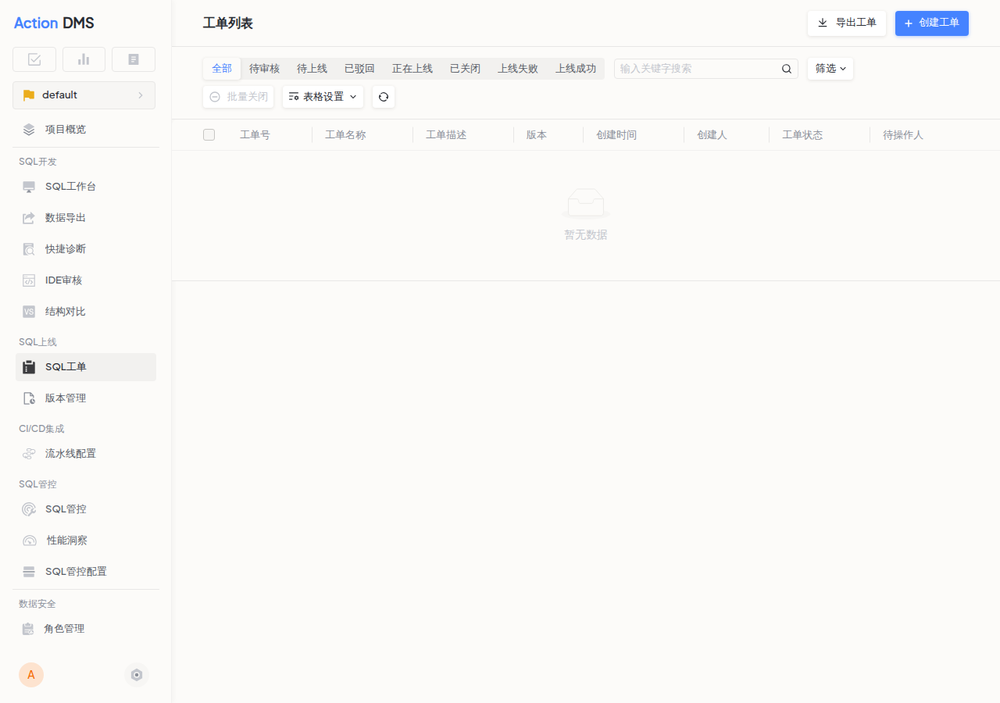

import Edition from '@site/src/components/Edition';

工单是 SQLE 中 SQL 变更上线的标准流程。开发人员通过创建工单提交待执行的 SQL，经过审核后由 DBA 或自动化流程完成上线。

## 前置条件

- 当前用户已被添加为项目成员，且拥有创建工单权限
- 项目管理员已完成 [数据源配置](../datasource.md) 和 [审批流程模板配置](../workflow-template-manager.md)

## 创建入口

进入项目后，点击左侧导航栏 **工单**，在工单列表页面点击 **创建工单** 按钮。

## 操作步骤

### 步骤一：填写工单基本信息

| 配置项 | 说明 | 是否必填 |
|--------|------|---------|
| 工单名称 | 支持中英文。若不填写，系统将根据数据源名称和时间自动生成 | 否 |
| 工单描述 | 说明本次变更的目的和内容，限 3000 字符 | 否 |

### 步骤二：配置数据源和 SQL

#### 选择数据源

| 配置项 | 说明 |
|--------|------|
| 数据源 | 选择 SQL 最终要执行的目标数据源 |
| 数据库 | 选择要操作的数据库（相当于 `USE` 语句） |

:::note 社区版 vs 企业版
- **社区版**：一个工单仅支持一个数据源
- **企业版**：一个工单支持添加多个数据源。添加多个数据源时，可选择 **相同 SQL 模式**（要求数据库类型相同）或为每个数据源分别编写 SQL
:::

#### 上传 SQL

平台提供以下上传方式：

| 方式 | 说明 | 适用场景 |
|------|------|---------|
| 在线输入 | 在编辑器中直接输入 SQL，支持语法高亮和格式美化 | 少量 SQL |
| 上传 SQL 文件 | 上传 `.sql` 格式文件 | 单文件 SQL |
| 上传 ZIP 文件 | 上传 `.zip` 压缩包，支持指定文件排序方式（按前缀/后缀升序） | 批量 SQL 文件 |

#### 选择上线模式

当 SQL 以文件方式上传时，支持两种上线模式：

| 模式 | 说明 |
|------|------|
| SQL 模式 | 文件中的 SQL 拆分为独立语句逐条执行，适用于需要细粒度管控的场景 |
| 文件模式 | 整个文件作为一个执行单元，适用于语句间有依赖关系的场景（支持 Oracle、PostgreSQL、MySQL） |

#### 备份配置

| 配置项 | 说明 |
|--------|------|
| 是否开启备份 | 开启后执行前会自动创建备份，便于回滚 |
| 回滚行数限制 | 预计影响行数超过该值时不执行回滚（默认 1000） |

### 步骤三：审核 SQL

点击 **审核** 按钮，平台将按数据源绑定的审核规则模板自动审核 SQL。

审核结果包含以下信息：

| 内容 | 说明 |
|------|------|
| 审核通过率 | 正常 SQL 数 / SQL 总数 |
| 审核评分 | 综合评分，考虑各等级（error / warn / notice）SQL 的占比 |
| 逐条审核结果 | 每条 SQL 触发的规则及告警等级 |
| 备份回滚策略 | 开启备份时显示平台推荐的备份策略 |

点击审核结果栏可在右侧抽屉中查看完整信息。

:::tip
- 可点击 **下载审核报告** 导出审核结果
- 开启 **去重** 后，结构相同的 SQL 仅显示一条
- 支持 SQL 美化（MySQL、PostgreSQL、Oracle、DB2、SQL Server 等）
:::

### 步骤四：提交工单

确认审核结果后，点击 **创建工单** 按钮完成提交。

## 工单列表

提交后可在工单列表中查看已创建的所有工单。

列表支持按工单状态、创建时间等条件筛选。点击 **导出工单** 可以 CSV 格式导出工单信息。

## 后续步骤

- [审核工单](audit-workflow.md) — 工单将按审批流程模板流转至审核人处
- [上线工单](exec-workflow.md) — 审核通过后进入上线环节
