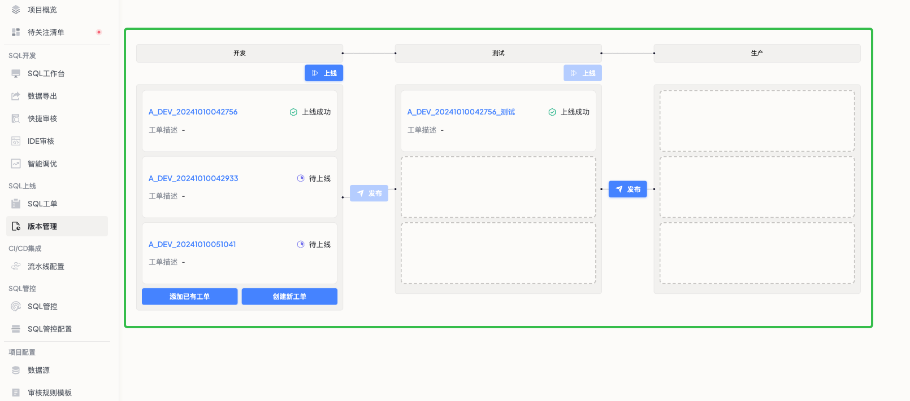

SQLE的版本管理功能适用于以下场景：

1. 大规模数据库升级项目
  * 管理多个环境（如开发、测试、生产）的数据库变更
  * 跟踪复杂的脚本执行进度
2. 日常数据库维护
  * 组织和追踪例行的数据库修改
  * 确保各环境间的数据库结构一致性
3. 多团队协作的数据库开发
  * 协调不同开发团队的数据库变更
  * 避免冲突并确保变更的顺序执行
4. 合规性和审计要求
  * 记录所有数据库变更的历史
  * 提供详细的变更日志以满足审计需求

##  前置操作
在开始使用版本控制功能之前，请确保：

* 已准备不同发布环境的数据源
* 已为团队成员分配适当的角色和权限

## 步骤一 创建新版本

**目标**：建立一个新的版本记录，定义版本信息和涉及的环境。

* 进入"版本管理"页面，点击"添加版本"按钮
* 填写版本信息：
  * 输入版本名称（如：v1_2_3）
  * 输入版本描述
* 设置版本涉及的发布阶段：
  * 添加需要的环境（如：开发、测试、预生产、生产）  
  * 添加每个环境中涉及的数据源
* 点击"保存"按钮确认配置

:::tip
版本名称建议使用有意义的标识，如功能名称加版本号，便于后续管理。
:::

## 步骤二 将变更添加至版本中

**目标**：将具体的数据库变更关联到创建的版本中。

* 在版本详情页第一个阶段中，新增该版本中涉及的变更
* 选择变更类型：
  * 新建工单：创建一个新的变更请求
  * 关联现有工单：将已存在的工单关联到此版本
* 点击"确认"，添加变更到版本

:::tip
* 仅能够关联这个阶段的数据源
::: 

## 步骤三 跟踪版本进度

**目标**：监控变更的执行进度，确保按计划进行。

* 进入版本详情页面，查看当前版本涉及的阶段及每个阶段中的变更工单完成进度
* 上线：一个阶段中的多个工单需按顺序执行上线
  * 当顺序中的工单具备上线条件时，工单操作人/项目管理员可以点击`上线`按钮，完成变更工单上线
* 发布：同一工单需要顺序发布到不同环境进行验证
  * 当一个工单在当前阶段已完成上线验证，需要发布到下一个阶段时，工单操作人/项目管理员可以点击`发布`按钮，将当前变更内容发布到下一阶段数据源验证

:::tip
* 上线：指在当前环境执行变更
* 发布：指将已验证的变更推进到下一个环境
:::

## 步骤四 完成版本发布

**目标**：确认所有变更已完成，并锁定版本。

* 确保所有环境的所有变更都已执行完毕
* 在版本列表点击`锁定`按钮，确认并锁定当前版本

