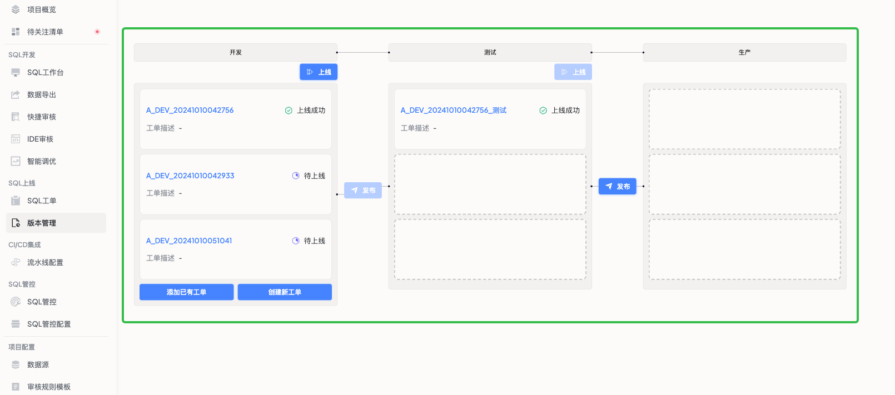

版本管理功能用于组织和跟踪数据库变更在多个环境（开发、测试、预发布、生产）中的发布流程，确保变更按顺序执行并逐步推进。

## 适用场景

- 大规模数据库升级项目，需要管理多环境的变更
- 日常数据库维护，需要追踪变更进度
- 团队协作开发，需要协调数据库变更的执行顺序
- 合规审计要求，需要记录完整的变更历史

## 前置条件

- 已准备好不同发布环境的数据源
- 已为团队成员分配创建工单和审批工单的权限

## 操作步骤

### 步骤一：创建版本

进入 **版本管理** 页面，点击 **添加版本**：

| 配置项 | 说明 |
|--------|------|
| 版本名称 | 建议使用有意义的标识（如 v1.2.3） |
| 版本描述 | 说明版本涉及的变更内容 |
| 发布阶段 | 添加涉及的环境（开发、测试、预生产、生产等），并指定每个环境中的数据源 |

### 步骤二：添加变更

在版本详情页的第一个阶段中添加变更：

- **新建工单**：创建新的变更工单
- **关联现有工单**：将已有工单关联到此版本

:::tip
仅能关联当前阶段数据源上的工单。
:::

### 步骤三：跟踪进度

在版本详情页查看各阶段的变更工单完成进度。

| 操作 | 说明 |
|------|------|
| 上线 | 在当前环境执行变更，同一阶段的多个工单需按顺序上线 |
| 发布 | 将已验证的变更推进到下一个环境 |

### 步骤四：锁定版本

所有环境的变更执行完毕后，在版本列表点击 **锁定**，版本锁定后无法继续在版本中发布变更。
