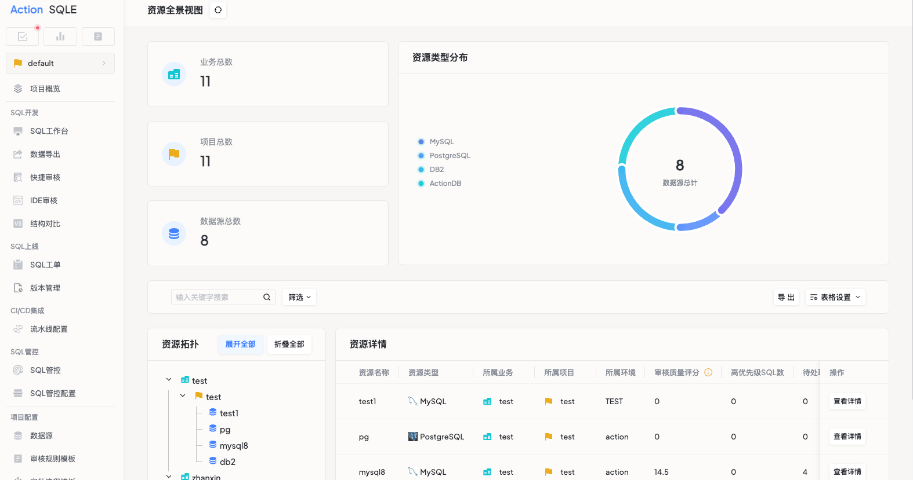

# 资源全景视图

## 功能说明
资源全景视图是一个可视化资源管理工具，帮助用户快速了解和掌握系统中所有资源的分布情况和关联关系。

## 应用场景
- 管理员日常系统巡检（5分钟快速巡检）
- 项目复盘时资源投入分析
- 故障发生时快速定位问题节点
- 资源分布情况总览

## 主要特点
1. 资源仪表盘
   - 实时统计卡片显示业务/项目/数据源数量
   - 资源分布可视化图表展示
   
2. 关系导航图
   - 业务→项目→数据源三层级联展示
   - 支持节点点击快速聚焦
   
3. 智能详情表
   - 关键指标一览无余
   - 支持一键跳转至具体资源

## 预期效果
- 减少多页面切换查找资源的时间
- 提升资源管理和问题处理效率
- 清晰展示资源间的关联关系

## 前置条件

### 使用权限要求
- 需要系统登录权限
- 需要对应资源的查看权限

### 数据准备
- 确保系统中已录入相关资源数据
- 资源间关联关系已建立

## 操作指南

### 功能入口位置
项目列表页面右上角`资源全景视图`按钮

### 操作步骤
1. 登录系统
2. 进入项目列表页面
3. 点击右上角「资源全景视图」按钮
4. 开始探索资源分布图

### 参数说明
- 统计卡片：显示各类资源数量
- 分布图：展示资源占比
- 关系图：展示资源间关联关系

### 操作结果展示
- 可查看全局资源统计数据
- 可浏览资源分布情况
- 可探索资源间关联关系
- 可快速定位具体资源详情

