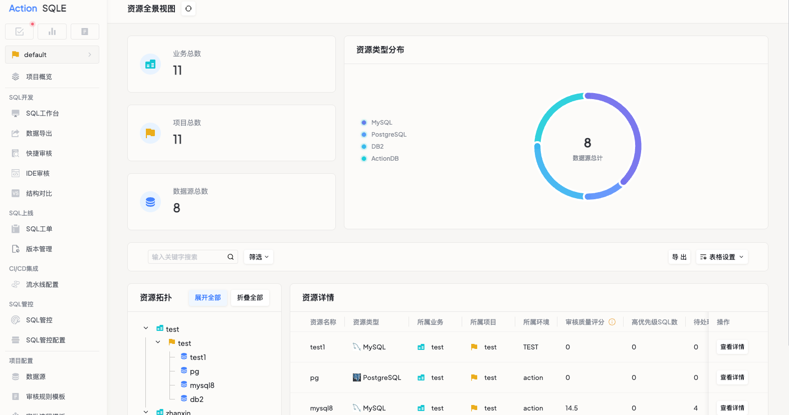

资源全景视图提供可视化的资源管理能力，帮助管理员快速了解系统中所有资源的分布情况和关联关系。

## 适用场景

- 日常系统巡检
- 项目复盘时分析资源投入
- 故障发生时快速定位问题节点
- 资源分布情况总览

## 功能入口

项目列表页面右上角 **资源全景视图** 按钮。

## 核心功能

| 功能 | 说明 |
|------|------|
| 资源仪表盘 | 实时统计业务、项目、数据源等资源数量 |
| 关系导航图 | 业务 → 项目 → 数据源三层级联展示，支持节点点击聚焦 |
| 智能详情表 | 关键指标一览，支持一键跳转至具体资源 |

