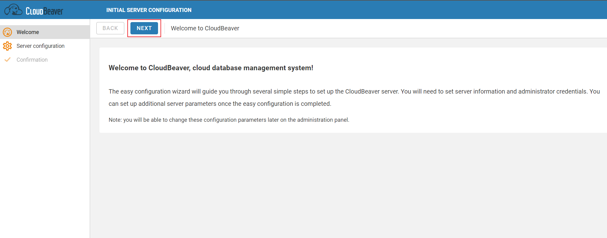
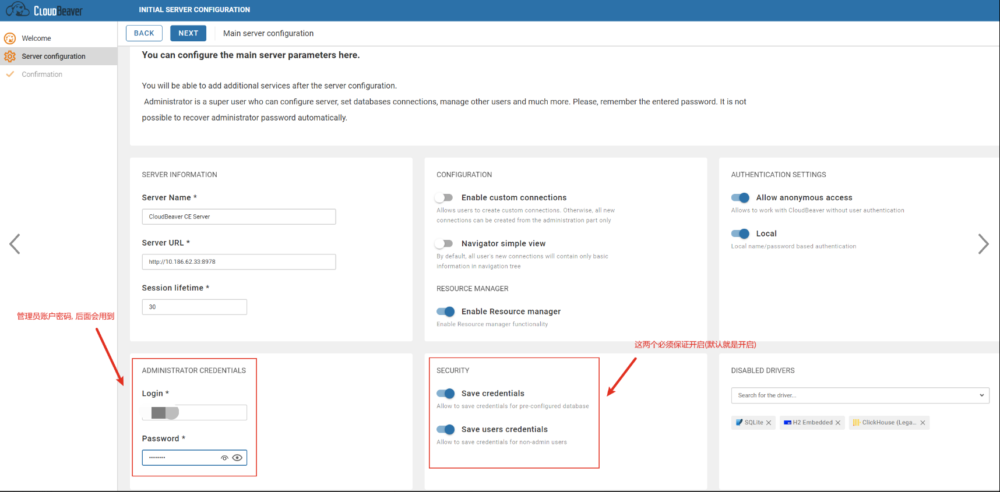
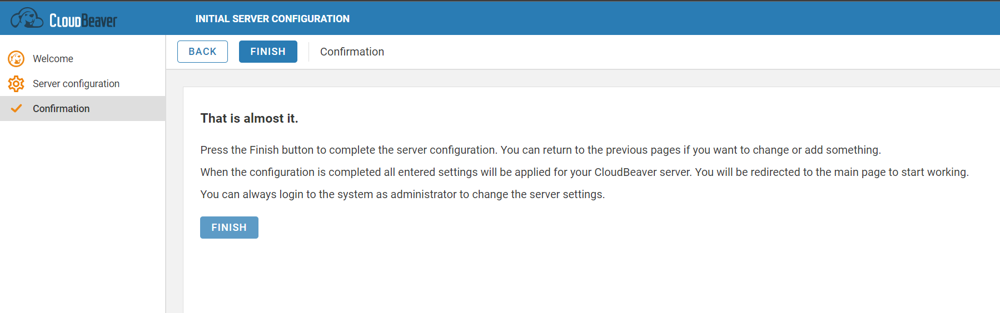
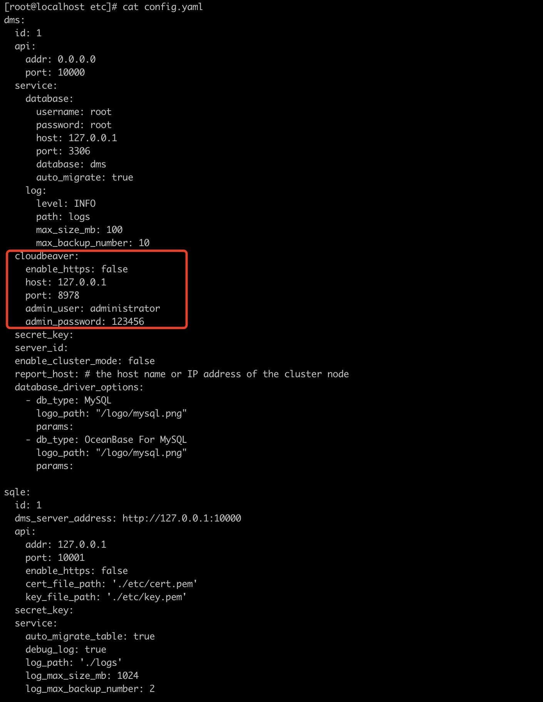

# 配置方法
### 安装CloudBeaver
:::tip
SQLE目前支持的CloudBeaver版本包括22.2.0、22.2.1、22.2.3、22.3.1、23.2.1版本,推荐使用23.2.1版本
:::

docker 部署：https://github.com/dbeaver/cloudbeaver/wiki/Run-Docker-Container

源码安装：https://github.com/dbeaver/cloudbeaver/wiki/Build-and-deploy

```
docker run -d --restart unless-stopped --name cloudbeaver --privileged -it -p 8978:8978 dbeaver/cloudbeaver:23.2.1
```

### 配置CloudBeaver
#### 步骤一 修改CloudBeaver配置文件cloudbeaver.conf
cloudbeaver.conf配置文件通常在docker容器的 /opt/cloudbeaver/conf 目录下

|配置文件名 | 是否必须修改 | 修改内容 | 修改原因|
|--|--|--|--|
|cloudbeaver.conf|是|将server.rootURI的值改为'/sql_query'；将server.serviceURI 的值改为 '/api/'(server.serviceURI默认就是/api/)|SQLE目前只支持代理这个路由|


#### 步骤二 重启CloudBeaver
配置CloudBeaver后，需要重启CloudBeaver以使配置项生效


#### 步骤三 初始化CloudBeaver
1.使用 http://{IP}:8978/sql_query#/ 可以进入CloudBeaver即代表配置正确

2.设置管理员用户名及密码：该用户名及密码将用于后续SQLE配置文件中，并确认security服务开启

3.完成设置，登录管理员账号成功，则初始化成功


#### 步骤四 配置完成后检查
* 确认角色正确:[访问管理] - [角色] 处应当只有admin和user两个角色

* 确认没有冲突用户:[访问管理] - [用户] 处不应当有名称格式为 sqle-xxx的用户存在, 这会与SQLE自动创建的用户冲突

:::tip
用admin 跳转CloudBeaver的时候，SQLE会在CloudBeaver创建一个新的用户叫sqle-admin ，同时把这个用户缓存到数据库里，每次跳转先去数据库里找这个用户，如果已经存在，就会拿这个用户直接去登陆cb 
:::

### 配置SQLE
#### 步骤一 修改SQLE配置文件中CloudBeaver参数
打开SQLE配置文件，配置文件一般位于SQLE工作目录的etc目录下, 文件名一般为config.yaml

|参数字段 | 参数说明 |
|--|-----|
|cloudbeaver|sql工作台参数|

子参数在下一级, 需要注意缩进

|参数字段 |	参数说明|
|--|-----|
|host|cloudbeaver IP地址|
|port | cloudbeaver访问端口|
|admin_user | cloudbeaver管理员账户 |
|admin_password|cloudbeaver管理员密码|

配置文件内容参考：



#### 步骤二 重启SQLE
需要重启以使配置项生效。

#### 步骤三 检查SQLE是否已成功集成CloudBeaver
SQLE重启后进入平台，点击打开SQL工作台，若成功跳转，则说明当前SQLE平台已成功集成CloudBeaver。

:::tip
* 平台管理员账户需要有 [添加/修改/删除] [用户/实例/权限] 的权限
* SQLE集成CloudBeaver后请勿使用CloudBeaver的管理员账户直接操作CloudBeaver的用户/实例/权限
:::

### 常见问题
如果在配置CloudBeaver时，出现跳转不正确等问题，可参考[如何解决CloudBeaver跳转不正确的问题](https://github.com/actiontech/sqle/discussions/1521)。