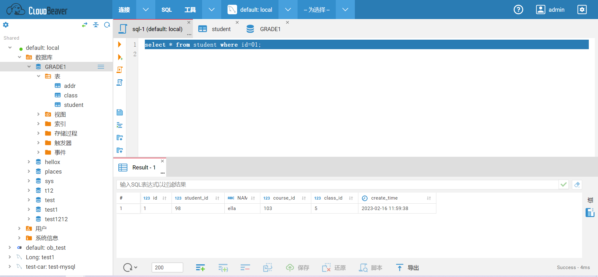

# 功能说明
CloudBeaver Community 是一个开源的 Web 数据库可视化管理工具，支持 PostgreSQL, MySQL, MariaDB, SQL Server, Oracle, DB2, Firebird, H2, Trino 等数据库。

SQLE通过集成CloudBeaver，使得SQLE具备数据库操作的能力，方便开发或DBA在SQLE中方便地操作数据库，具体表现为：
#### 用户信息和实例信息同步
* SQL工作台与SQLE平台的用户管理系统紧密集成，自动同步用户信息和数据库实例信息。这一特性确保了只有授权用户才能访问和操作相关数据库，从而保护了数据的安全性和隐私性。
#### SQL工作台查询审核
* 为了提高SQL语句的合规性，您可以在数据源设置中开启`SQL工作台查询审核`功能。此功能会对通过SQL工作台执行的每一条SQL语句进行实时规则审核，确保所有查询都符合既定的安全和性能标准，从而有效避免潜在的不合规查询。
#### 操作审计
* SQLE平台提供了审计页面，您可以在其中查看SQL工作台产生的所有数据库操作行为。这包括查询、更新、删除等操作，帮助您实现全面的操作审计和监控。

## 前置条件
安装CloudBeaver并完成配置，参考[SQL工作台配置方法](how-to-configure.md)。

## 使用场景
当业务人员需要对数据库进行数据检索时，一些查询SQL可能会造成数据库性能问题甚至夯死。但在传统的使用场景中，DBA很难对业务人员的行为进行追踪和管控，无法限制有问题的SQL在生产环境执行。
因而SQLE平台集成CloudBeaver数据库可视化管理工具，满足在线SQL查询需求的同时，进行业务人员的操作权限控制，并对业务人员的SQL进行审计，拒绝不合规的SQL运行。

### 自主审核场景
假设业务部门需要定期从数据库中提取销售报告。业务人员不熟悉SQL或数据库性能影响因素，因此需要开启SQL查询审核，业务人员可以结合审核规则改进查询语句，减少因查询不合理导致的数据库问题。
#### 步骤一 SQLE平台配置用户
* 创建一个用户A；
* 创建一个有SQL查询权限的角色：SQL查询；

#### 步骤二 SQLE平台配置成员权限
* 在项目内添加数据源实例test，并开启数据源上的SQL工作台查询审核能力
* 在项目内添加成员A，并设置A在实例test上有SQL查询的角色；

#### 步骤三 登录CloudBeaver
切换成员A账号后，点击SQL工作台跳转CloudBeaver，SQLE将会自动使用当前SQLE用户登录CloudBeaver。 
:::caution
若当前用户无SQL查询权限，则无权登录。
:::

#### 步骤四 下发SQL
选择需要操作的数据源，输入SQL后，点击SQL审核图标，对编写的SQL 进行规则审核；

####  操作结果
获取优化建议；

### 审核拦截场景
假设数据库包含重要的交易信息。为了防止不当查询导致数据被删除，因此需要设置一个拦截审核机制，识别高危的SQL操作，保障数据库数据安全。
#### 步骤一 SQLE平台配置用户及角色
* 创建一个用户A；
* 创建一个有SQL查询权限的角色：SQL查询；

#### 步骤二 SQLE平台配置数据库实例审核等级
进入项目，创建/修改一个数据源实例A, 在配置中开启SQL工作台查询审核，并设置运行查询的最高审核等级；

|参数名	| 参数含义|
| -- | -- |
|SQL工作台查询是否需要审核 | 只有开启此项，才会在执行SQL查询时进行审核|
|运行查询的最高审核等级| 如果审核等级低于或等于这个等级将会放行, 高于这个等级将无法执行|

#### 步骤三 SQLE平台配置成员权限
* 在项目内添加成员A，并设置A在实例test上有SQL查询的角色；

#### 步骤四 登录CloudBeaver
切换成员A账号后，点击SQL工作台跳转CloudBeaver，SQLE将会自动使用当前SQLE用户登录CloudBeaver。
:::caution
若当前用户无SQL查询权限，则无权登录。
:::

#### 步骤五 下发SQL
选择需要操作的数据源，并输入SQL语句点击运行，可查看SQL查询结果

####  操作结果
审核失败的SQL将会被拦截, 并报出错误, 可以点击详情查看错误详情

按要求修改SQL, 再次执行, 如果审核通过将会执行当前SQL

### 权限控制场景
假设公司需要确保开发团队和业务分析师只能访问他们工作所需的数据，无法直接修改原始数据，所有对生产数据的变更都经过严格审批，可以对用户数据库操作进行精细化访问控制，确保用户只能执行其被授权的操作。
#### 步骤一 SQLE平台配置用户及角色
* 创建一个用户A；
* 创建一个拥有SQL查询权限的角色：SQL查询；
* 创建一个拥有创建工单权限的角色：创建工单；

#### 步骤二 SQLE平台配置成员权限
* 在项目内添加数据源
  * 实例1:testread，连接账号仅拥有读取权限；
  * 实例2:testwrite，连接账号拥有读写权限；
* 在项目内添加成员A，并设置A的权限为
  * 在实例testread上有SQL查询的角色；
  * 在实例testwrite上有创建工单的角色；

#### 步骤三 登录CloudBeaver
切换成员A账号后，点击SQL工作台跳转CloudBeaver，SQLE将会自动使用当前SQLE用户登录CloudBeaver。 
* 可以看到有实例testread（因为在这个实例上具备SQL查询权限）；
  * 但由于连接账号只有读取权限，所以无法通过CloudBeaver进行数据变更；
* 无法看到实例testwrite（因为在这个实例上不具备SQL查询权限）；
  * 但可以对实例testwrite创建变更工单，提交数据变更申请。
