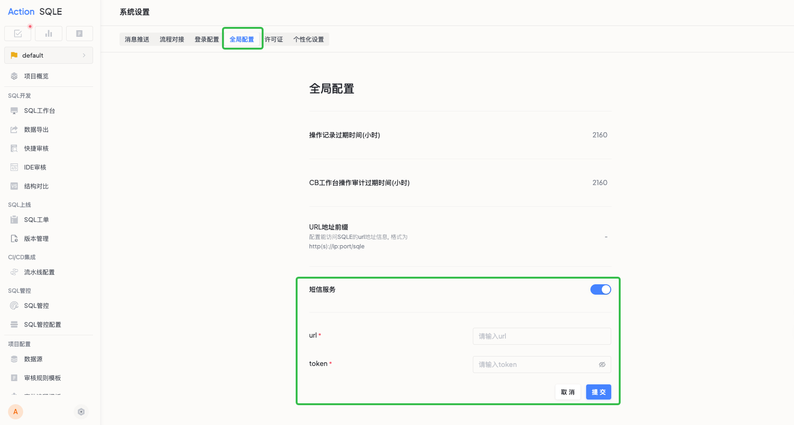
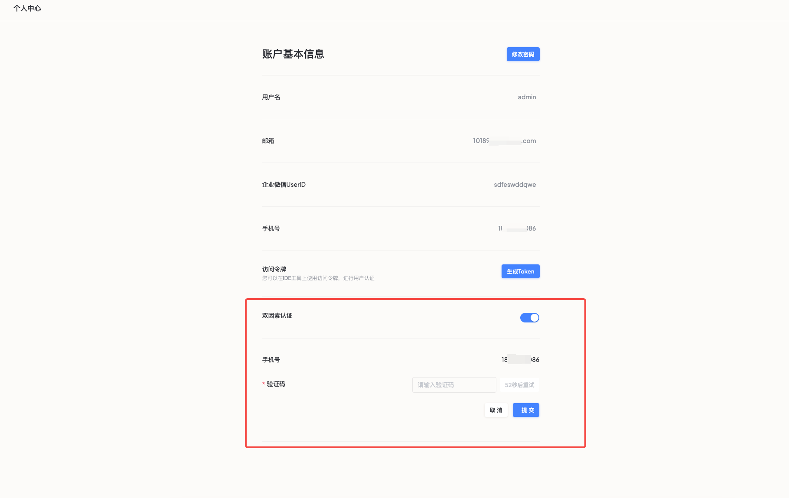

# 双因素认证 (2FA)

## 简介
双因素认证（Two-Factor Authentication，简称 2FA）是一种增强账号安全性的重要功能。它通过要求用户同时提供两种不同的身份验证要素（密码 + 短信验证码），有效防止未授权访问和账号盗用。

### 适用场景
- 企业用户：需要保护敏感数据和重要业务信息。
- 管理员账号：处理系统核心配置和重要操作。
- 个人用户：对账号安全有较高要求。
- 合规需求：需要满足金融、医疗等行业的安全标准。

### 核心优势
🔐 双重安全保障，显著提升账号安全性；

🛡️ 有效防范账号盗用和未授权访问；

⚔️ 防护密码泄露、撞库等网络攻击；

✅ 符合行业安全合规要求；

📱 便捷的手机验证码验证方式；

## 使用准备

### 系统要求
- 管理员已完成短信服务配置
- 用户已绑定有效手机号码
- 确保手机可正常接收短信

### 功能开启流程

#### 管理员配置
1. 使用管理员账号登录系统
2. 导航至：系统配置 > 全局设置
3. 找到"短信服务"配置模块
4. 配置以下参数：
   - **Webhook URL**：短信服务接口地址
   - **Token**：接口访问令牌
5. 保存并启用服务



#### 用户开启
1. 登录个人账号
2. 进入：个人中心
3. 找到"双因素认证"选项
4. 按提示验证手机号
5. 确认开启 2FA 功能



## 技术对接

### Webhook 接口规范

**请求格式**
```http
POST http://your-sms-service-url
Content-Type: application/json

{
    "phone": "13xxxx38000",
    "verify_code": "1234",
    "token": "your-sms-service-token"
}
```

**响应要求**
- 状态码：必须返回 HTTP 200
- 响应体：格式不限

## 使用说明

### 登录流程
启用 2FA 后的登录步骤：
1. 输入账号和密码
2. 系统发送验证码至绑定手机
3. 输入收到的验证码
4. 验证通过后完成登录

### 安全建议
- ⚠️ 验证码仅一次有效，请勿重复使用
- ⚠️ 更换手机号后及时更新绑定信息
- ⚠️ 严禁向任何人泄露验证码
- 📱 确保手机安全存放
- 🔑 定期更新账号密码
- 📞 及时更新手机号码绑定

## 常见问题

1. **未收到验证码？**
   - 检查手机信号是否正常
   - 确认手机号绑定是否正确
   - 查看短信是否被拦截

2. **需要更换手机号？**
   - 请使用原手机号登录
   - 进入个人中心更新绑定信息

3. **临时无法使用 2FA？**
   - 请联系系统管理员处理
