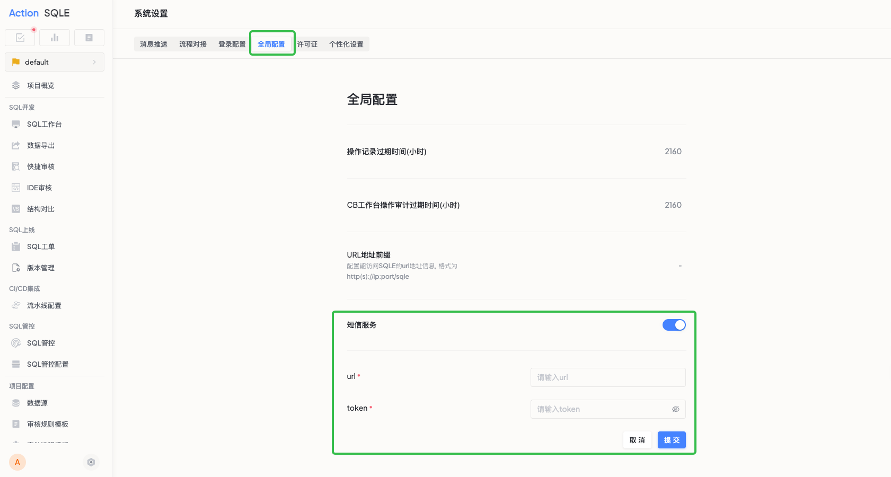
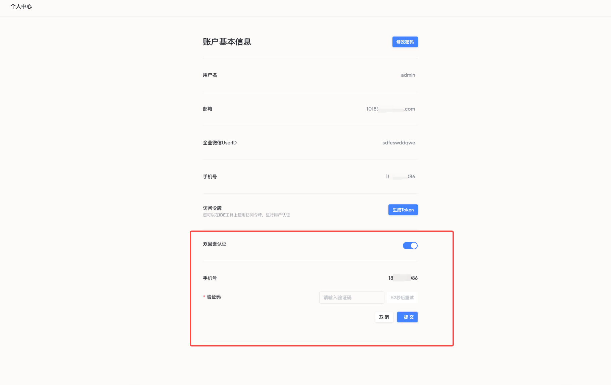

双因素认证（2FA）通过密码 + 短信验证码的方式增强账号安全性，防止未授权访问。

## 前置条件

- 管理员已完成短信服务配置
- 用户已绑定有效手机号码

## 管理员配置

1. 进入 系统配置 → 登录配置 → **短信服务**
2. 配置 Webhook URL（短信服务接口地址）和 Token（访问令牌）
3. 保存并启用



### Webhook 接口规范

```json
POST http://your-sms-service-url
Content-Type: application/json

{
    "phone": "13xxxx38000",
    "verify_code": "1234",
    "token": "your-sms-service-token"
}
```

接收端需返回 HTTP 200。

## 用户开启

1. 进入 **个人中心**
2. 找到「双因素认证」选项
3. 验证手机号后开启



## 登录流程

启用 2FA 后：

1. 输入账号和密码
2. 系统发送验证码至绑定手机
3. 输入验证码完成登录

:::tip
- 验证码仅一次有效
- 更换手机号后请及时更新绑定信息
:::
