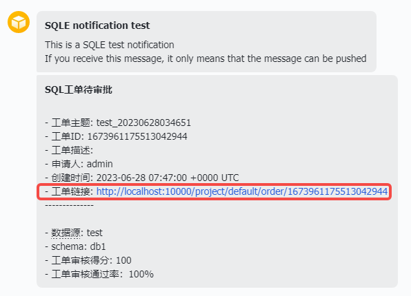

全局配置用于管理平台级别的基础参数。

## 功能入口

管理员账号 → 系统设置 → **全局配置** 标签。

## 配置项

### 操作记录过期时间

平台定时清理过期的操作记录，默认保留 90 天。可自定义过期时间（如 2 小时、30 天等）。

### URL 地址前缀

配置消息推送或流程对接后，用户需要从外部应用中跳转回 SQLE 平台查看工单详情。此处设置 SQLE 的访问地址前缀，格式为 `http://ip:port`。

