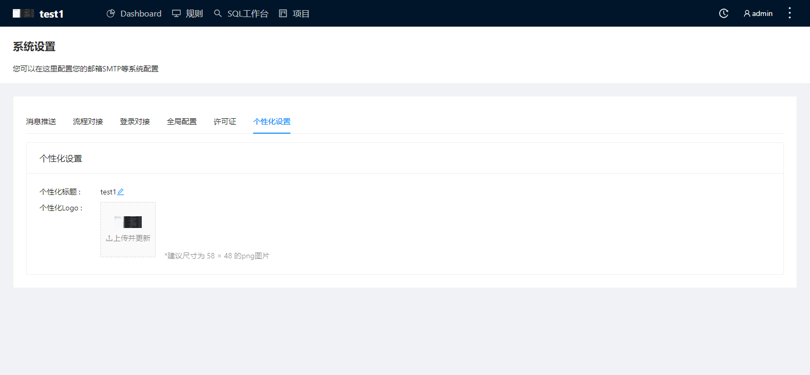

SQLE支持对网站logo及标题进行自定义设置，满足企业用户的个性化需求。

### 使用场景
若用户对企业一致性有需求，需要变更所使用的网站logo及标题，以增加企业辨识度时，可以使用平台的个性化设置进行变更。

### 操作步骤

* 用户点击系统设置，选择个性化设置；
* 编辑标题：用户点击个性化标题后的编辑icon，输入新名称`test`，回车键保存后，页面标题将变更为`test`；
* 编辑个性化logo：用户点击上传及更新icon，选择需要的图片，点击打开后，页面logo将变更为所选图片；
  * 限制：图片大小不可超过102,400 Bytes；

