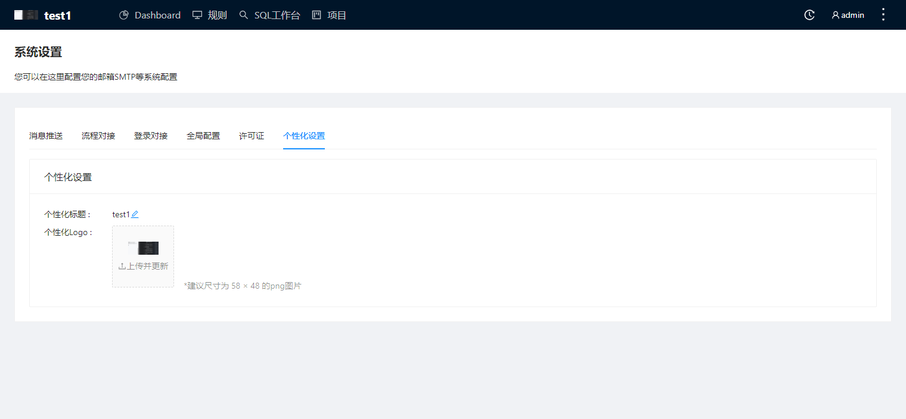

import Edition from '@site/src/components/Edition';

# 个性化设置 <Edition type="enterprise" />

支持自定义平台的 Logo 和标题，满足企业品牌一致性需求。

## 功能入口

管理员账号 → 系统设置 → **个性化设置**。

## 可配置项

| 配置项 | 说明 | 限制 |
|--------|------|------|
| 个性化标题 | 修改平台名称（如将 DMS 改为 SQLE） | — |
| 个性化 Logo | 上传自定义 Logo，替换登录页默认 Logo | 图片大小不超过 100KB |

