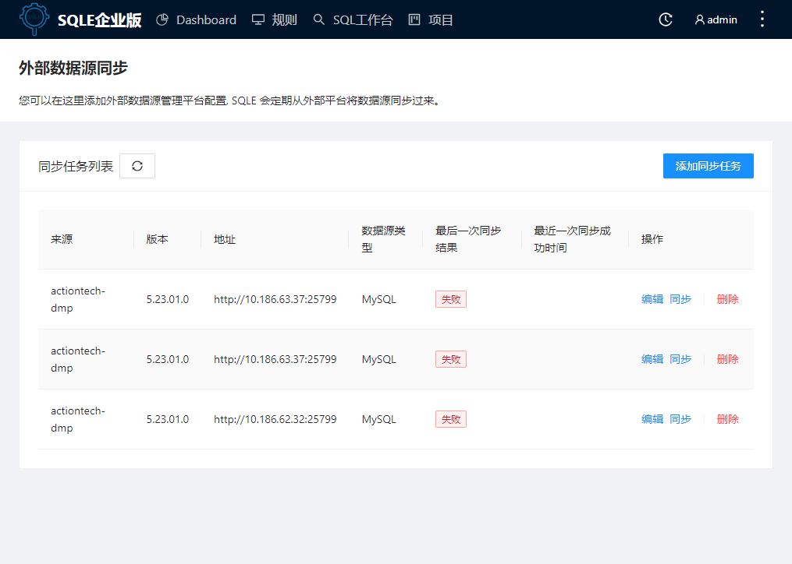

# 外部数据源同步
SQLE支持从其他平台导入数据源的功能，方便用户接入外部平台的数据源，目前已实现对接爱可生商业产品“云树·DMP：数据库集群管理平台”。

### 使用场景
如果用户需要使用SQLE对接其他既有平台上的数据源进行SQL管理，只需要在SQLE上创建同步数据源任务，将外部平台的数据源同步至SQLE平台，无需在两个平台上重复添加数据源。

### 前置条件
在DMP平台创建/接管数据源，给DMP的数据源组添加SIP（目前SQLE只会同步配置了SIP的数据源组）

:::tip
版本限制：目前仅支持DMP5.23.04.0及以上版本
:::

### 操作步骤
* 进入SQLE平台，点击右上角菜单的“外部数据源同步”，进入同步任务页面
* 添加同步任务，填写以下相关信息
    * 来源：目前仅支持DMP平台
    * 地址：默认格式为http://ip:port
    * 数据源类型
    * 审核规则模板
    * 设置同步间隔：SQLE平台将按照指定的同步时间进行周期性同步
* 点击“提交”按钮，SQLE会立即进行一次数据源同步。

### 操作结果
同步成功后进入“default”项目的数据源列表页面，可以看到DMP上配置了SIP的数据源组已经被添加到SQLE平台，可以对这个数据源进行创建工单或扫描任务等操作。

### 后续操作
管理员可编辑或删除同步任务，也可在同步周期之外，手动执行同步任务。