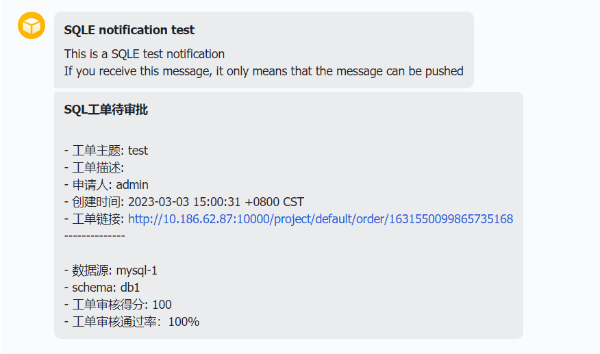

消息推送功能在工单状态变更时，将通知发送到相关人员的第三方应用中，避免因未及时登录平台查看工单状态造成的进度滞后。

## 功能入口

管理员账号 → 系统设置 → **消息推送** 标签。

## 支持的推送方式

### SMTP 邮箱推送

| 配置项 | 说明 |
|--------|------|
| SMTP 地址 | SMTP 服务器地址（如 smtp.163.com） |
| SMTP 端口 | SMTP 服务端口（如 25） |
| SMTP 用户名 | 完整邮箱用户名 |
| SMTP 密码 | 邮箱授权码（非登录密码） |

### 企业微信推送

| 配置项 | 说明 |
|--------|------|
| CorpID | 企业微信企业 ID |
| CorpSecret | 应用密钥 |
| 企业微信应用 ID | 应用的 agentid |
| 是否开启加密传输 | 开启后推送为通知形式，需点击查看详情 |
| 代理服务器 IP | 企业微信代理服务器 IP（可选） |

:::tip
需在企业微信应用中配置企业可信 IP，参考 [企业微信官方文档](https://developer.work.weixin.qq.com/document/path/95672)。
:::

### 飞书推送

| 配置项 | 说明 |
|--------|------|
| App ID | 飞书应用凭证 |
| App Secret | 飞书应用密钥 |

:::tip
需创建飞书企业应用并开通机器人功能，参考 [飞书官方文档](https://open.feishu.cn/document/client-docs/bot-v3/add-custom-bot)。
:::

## 测试推送

各推送方式配置完成后，可点击 **测试** 按钮发送测试消息验证配置是否正确。

## 推送效果

开启推送后，工单状态变更时，相关人员可在对应的第三方应用中收到通知。

:::tip
如需在推送消息中包含工单链接，请在 [全局配置](configuration.md) 中设置 URL 地址前缀。
:::
