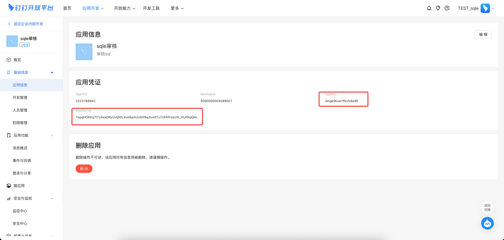
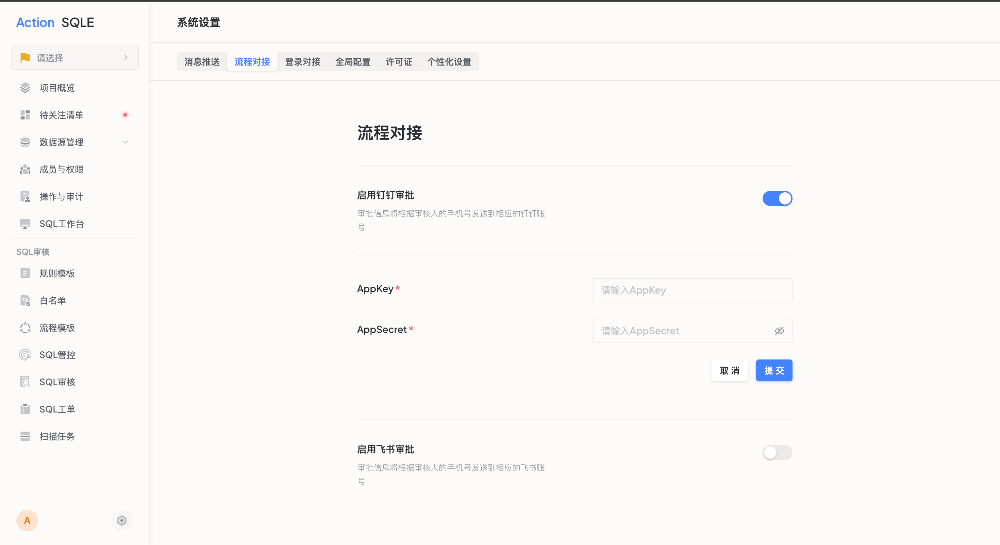
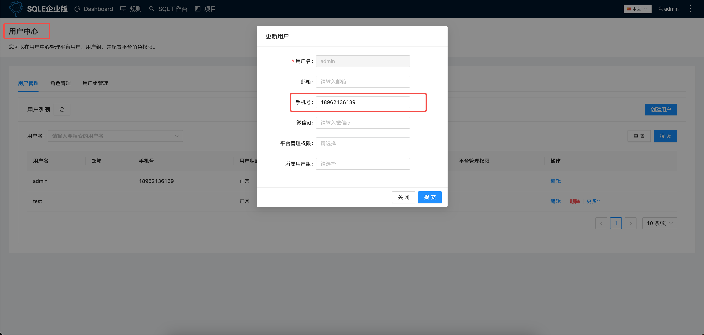

# 流程对接

通过流程对接功能，用户可以将SQLE平台的工单审批操作对接到指定的平台，使用户能够在该平台上完成工单审核和上线操作，避免在多个平台之间切换。目前我们支持钉钉和飞书审批。

## 使用场景

当用户日常使用钉钉或飞书作为办公协作软件时，可以配置审批对接流程。配置成功后，可以通过这些即时协作工具在移动端进行工单审批操作。

## 钉钉审批操作步骤

### 创建钉钉应用
打开[钉钉开发者后台](https://open-dev.dingtalk.com/fe/app#/corp/app)，点击右上角的`创建应用`按钮；

创建成功后，页面会跳转到应用信息页面，可以获取该应用的AppKey和AppSecret；

### 配置应用权限
点击该应用的`权限管理`标签，点击`通讯管理`，开通 `企业员工手机号信息`，`成员信息权限`，`根据手机号姓名获取成员信息`的接口访问权限；

点击 `OA审批`，开通 `工作流实例写权限`，`工作流模版写权限`，`工作流实例读权限`；

### 配置SQLE
管理员账号，进入`系统设置`页面，点击`流程对接`，点击`编辑`按钮，选择启用，并填写应用的AppKey和AppSecret信息；

配置项目成员的手机号，手机号必须与钉钉账户的手机号相同；

打开全局配置，配置SQLE的URL地址，配置URL地址后，用户可从钉钉跳转访问SQLE工单详情页面；

### 利用钉钉进行审批
当发生工单变化时，工单关联成员可在对应钉钉账号中收到通知，并进行相应的审批操作；

## 飞书审批操作步骤

### 创建飞书应用

进入飞书开放平台，创建飞书应用。
创建成功后，页面会跳转到应用信息页面，可以获取该应用的AppKey和AppSecret；

### 配置应用权限
点击该应用的`权限管理`标签，点击`审批`，开通 `查看、创建、更新审批应用相关信息`，`访问审批应用`的接口访问权限；

点击 `权限管理`标签，点击`通讯录`，开通以下权限： `获取通讯录基本信息`，`获取用户邮箱信息`，`获取用户UserID`，`通过手机号或邮箱获取用户的ID`，`获取用户手机号`；

### 配置SQLE
管理员账号，进入`系统设置`页面，点击`流程对接`，启用飞书审批，并填写应用的AppKey和AppSecret信息；

配置项目成员的手机号/邮箱，手机号或邮箱必须与飞书账户相同；

打开全局配置，配置SQLE的URL地址，配置URL地址后，用户可从飞书跳转访问SQLE工单详情页面；

### 利用飞书进行审批
当发生工单变化时，工单关联成员可在对应飞书账号中收到通知，并进行相应的审批操作；
