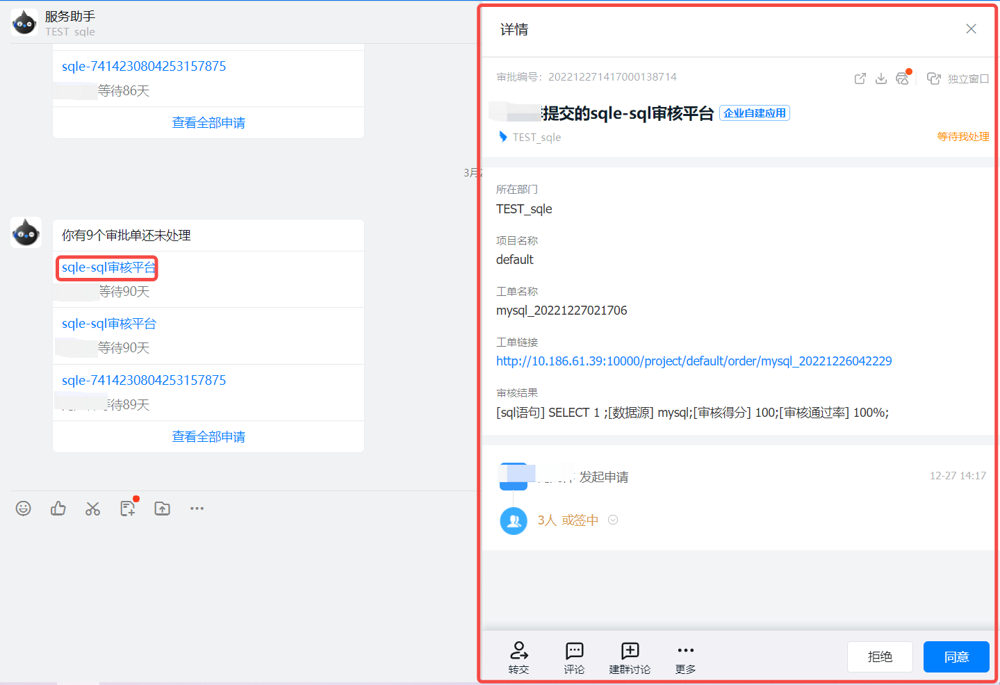
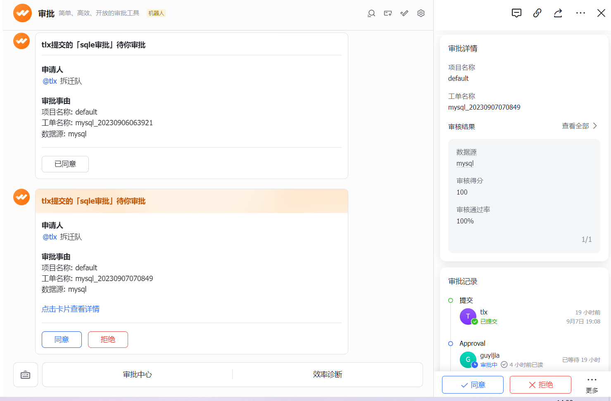
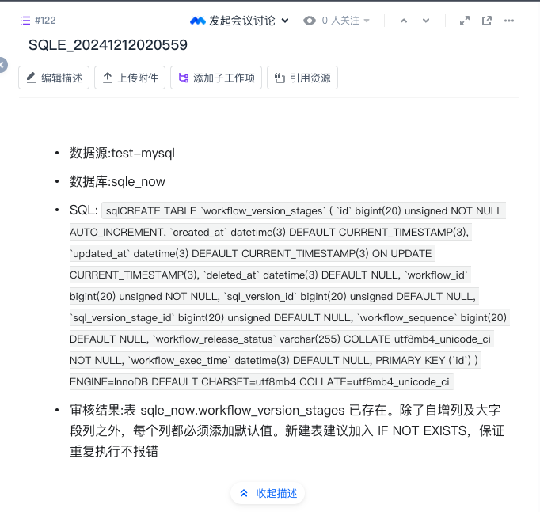

流程对接功能将 SQLE 工单审批操作对接到钉钉、飞书或 Coding 等协作平台，使用户能够在日常使用的办公工具中完成工单审核和上线操作。

## 功能入口

管理员账号 → 系统设置 → **流程对接** 标签。

## 钉钉审批

### 前置条件

1. 在 [钉钉开发者后台](https://open-dev.dingtalk.com/fe/app#/corp/app) 创建企业内部应用
2. 为应用开通以下权限：
   - 通讯管理：成员信息读权限
   - OA 审批：工作流实例读写权限
3. 在 [全局配置](configuration.md) 中设置 URL 地址前缀

### 配置项

| 配置项 | 说明 |
|--------|------|
| AppKey | 钉钉应用的 AppKey |
| AppSecret | 钉钉应用的 AppSecret |

### 使用要求

- 项目成员需配置手机号，且与钉钉账户手机号一致
- 工单中的审核人员需能在钉钉通讯录中被找到

### 使用效果

工单状态变化时，相关成员在钉钉中收到审批通知，可直接在钉钉内完成审批操作。

## 飞书审批

### 前置条件

1. 在 [飞书开放平台](https://open.feishu.cn/) 创建企业自建应用
2. 为应用开通以下权限：
   - 审批：创建审批定义、创建审批实例、更新审批实例
   - 通讯录：获取用户 ID、获取用户基本信息
3. 在 [全局配置](configuration.md) 中设置 URL 地址前缀

### 配置项

| 配置项 | 说明 |
|--------|------|
| AppKey | 飞书应用的 App ID |
| AppSecret | 飞书应用的 App Secret |

### 使用要求

- 项目成员需配置手机号或邮箱，且与飞书账户一致
- 飞书应用需通过审批后才能在组织内使用

### 使用效果

工单状态变化时，相关成员在飞书中收到审批通知，可直接在飞书内完成审批操作。

## Coding 对接

Coding 对接用于将 SQL 管控中发现的问题 SQL 推送到腾讯云 Coding 平台，以事项（Issue）形式分配给团队成员跟踪处理。

### 前置条件

1. 在 Coding 平台创建 [项目令牌](https://coding.net/help/docs/project-settings/feature/deploy-tokens.html) 或个人访问令牌
2. 在 Coding 中创建目标项目并初始化事项管理

### 配置项

| 配置项 | 说明 |
|--------|------|
| Coding 服务地址 | Coding 团队域名地址（如 `https://team.coding.net`） |
| API Token | Coding 项目令牌或个人访问令牌 |

### 测试连通性

配置完成后，可点击 **测试** 按钮验证 SQLE 是否能正确连接 Coding 平台。

### 使用效果

在 SQL 管控列表中，可一键将问题 SQL 推送到 Coding 平台创建事项，进行任务分配和进度追踪。

