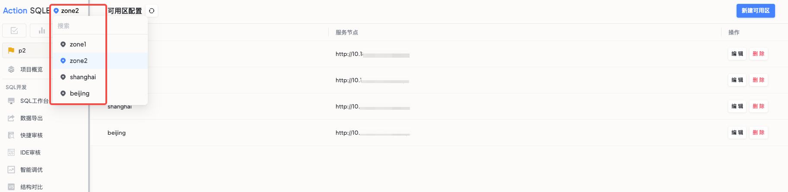

可用区功能用于集中管理分布在不同网络区域的数据库资源，适用于多地域机房部署、跨区域访问受限等场景。

## 适用场景

- 数据库分散在不同地区机房，需要统一管理
- 企业网络安全策略限制跨区域访问
- 需要同时兼顾运维效率和安全合规

## 功能入口

项目管理 → **可用区管理**。

## 操作步骤

### 管理员操作

1. 创建网络可用区（如 Zone-北京、Zone-上海）
2. 配置可用区参数

### 用户操作

1. 登录系统，选择已授权的可用区
2. 在可用区内进行数据库管理操作

:::tip
- 建议按照地理位置或业务划分可用区
- 确保网络区域间的连接稳定
- 定期检查数据同步状态
:::
