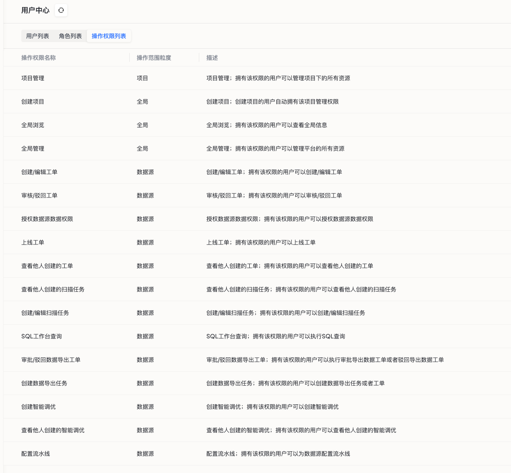

角色用于定义用户在项目内可执行的操作权限。一个角色是一组操作权限的集合，通过将角色绑定到项目成员，控制成员在特定数据源上可执行的操作。

## 前置条件

- 当前用户为平台管理员

## 功能入口

点击顶部导航栏右侧 **更多** 按钮，选择平台管理栏目下的 **用户中心**，切换到 **角色管理** 标签页。

## 默认角色

系统预置以下角色，不可删除：

| 角色 | 权限 |
|------|------|
| DEV | 创建工单、查看工单 |
| DBA | 审核工单、上线工单、创建/管理扫描任务 |
| 项目管理员 | 项目内所有操作（自动分配，不需手动绑定） |

## 创建角色

点击右上角 **创建角色** 按钮，填写以下信息：

| 配置项 | 说明 | 是否必填 |
|--------|------|---------|
| 角色名 | 角色名称，创建后不可修改 | 是 |
| 角色描述 | 补充说明角色的适用场景 | 否 |
| 操作权限 | 勾选该角色可执行的操作 | 是 |

### 支持的操作权限

| 权限类别 | 具体操作 |
|----------|---------|
| 工单相关 | 创建工单、审核/驳回工单、上线工单、查看他人创建的工单 |
| 扫描任务 | 创建智能扫描任务、查看扫描结果 |
| SQL 查询 | 查询 SQL、导出数据 |

## 更多操作

| 操作 | 说明 |
|------|------|
| 编辑 | 修改角色描述和操作权限（角色名不可更改） |
| 删除 | 删除角色。已被项目成员引用的角色删除后，对应成员将失去该角色的权限 |

## 后续步骤

- [成员管理](../project/group_member.md) — 在项目中为成员绑定角色和数据源，使角色权限生效
