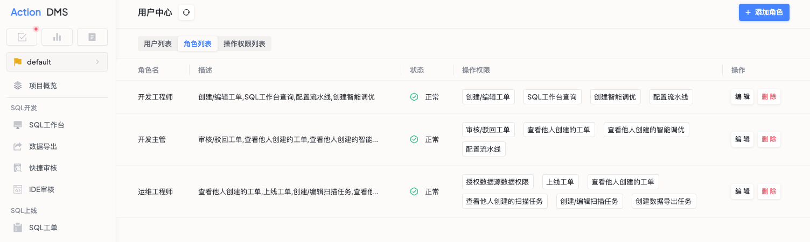
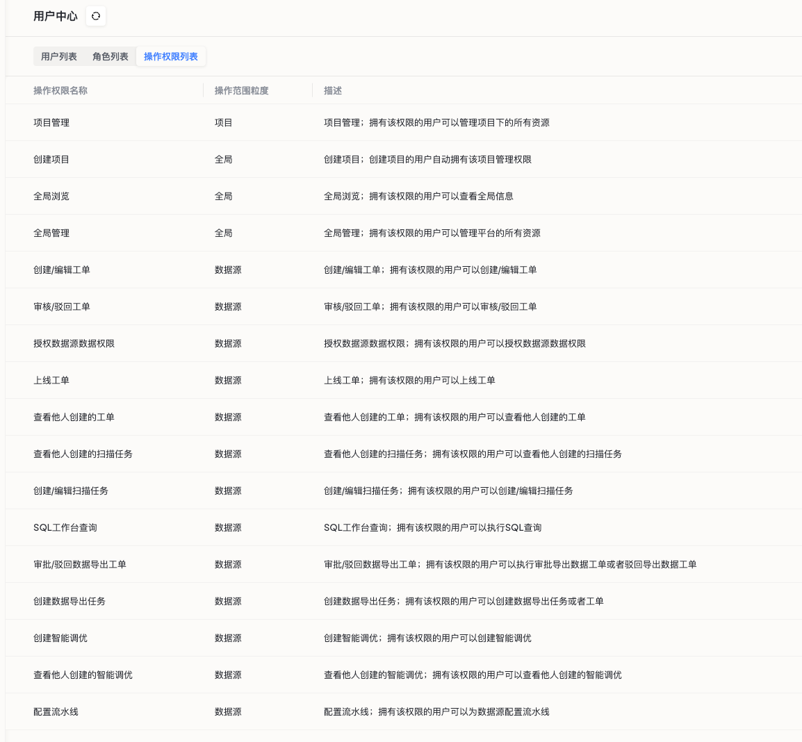

# 角色管理
当需要为用户设置动作权限时，可使用角色管理配置动作组合。

### 默认角色
当前支持的默认角色有如下三种：

### 如何新建角色
用户可以根据权限配置需要，自定义角色权限。

#### 操作步骤
* 点击顶部导航栏`更多`按钮，点击平台管理栏目下的`用户中心`选项，查看角色管理标签。
* 点击列表右上角`创建角色`按钮，填写相关信息
  * 角色名：给角色起一个名字。
  * 角色描述：简要描述角色的用途。
  * 选择动作权限：勾选这个角色可以执行的操作，以下是平台支持的操作权限：

### 查看和管理角色
#### 查看角色
创建后，用户可以在角色列表查看查看所有角色的详细信息。

#### 编辑角色
* 如果需要修改角色信息，点击角色旁边的`编辑`按钮。请注意，角色名一旦创建无法更改.

#### 删除角色
* 如果需要删除某个角色，点击角色旁边的`删除`按钮。这将移除角色及其权限设置。