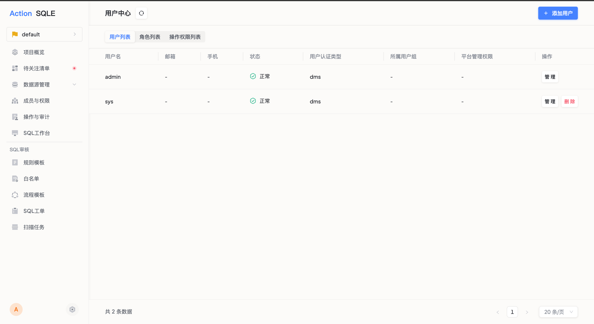

用户是平台中最基本的身份单位。平台管理员通过用户管理功能创建用户账号、分配平台角色以及进行日常维护。

## 前置条件

- 当前用户为平台管理员

## 功能入口

点击顶部导航栏右侧 **更多** 按钮，选择平台管理栏目下的 **用户中心**，进入用户列表页面。

## 用户列表

列表展示平台中所有用户的基本信息：

| 列名 | 说明 |
|------|------|
| 用户名 | 用户的登录标识 |
| 邮箱 | 用户邮箱地址，用于接收工单通知等消息推送 |
| 平台角色 | 用户的系统级角色 |
| 认证方式 | 登录认证方式（平台认证 / LDAP / OAuth 等） |
| 状态 | 正常或已禁用 |

## 创建用户

点击右上角 **创建用户** 按钮，在弹出的表单中填写以下信息：

| 配置项 | 说明 | 是否必填 |
|--------|------|---------|
| 用户名 | 登录标识，创建后不可修改。建议使用统一规范（如工号、姓名拼音） | 是 |
| 密码 / 确认密码 | 初始登录密码，需输入两次确认一致 | 是 |
| 邮箱 | 用户邮箱。开启邮件推送服务后，系统将通过此邮箱发送通知 | 否 |
| 微信 ID | 企业微信 ID。开启企业微信推送服务后，系统将通过此 ID 推送通知 | 否 |
| 平台角色 | 系统级角色，决定用户在平台层面的基础权限 | 是 |

### 平台角色说明

| 角色 | 说明 |
|------|------|
| 系统管理员 | 拥有平台最高权限，可管理所有功能模块 |
| 审计管理员 | 负责审计系统操作日志 |
| 项目总监 | 可查看所有项目，通常用于管理层 |
| 普通用户 | 基础访问权限，具体操作权限由所在项目的角色决定 |

创建成功后，用户会出现在用户列表中。

## 更多操作

| 操作 | 说明 |
|------|------|
| 编辑 | 修改用户信息（用户名不可更改） |
| 删除 | 永久删除用户 |
| 修改密码 | 由管理员重置用户密码，点击用户列表中的 **更多 → 修改该用户密码** |
| 禁用 / 启用 | 禁用后用户无法登录和执行任何操作。管理员无法禁用自身账号 |

## 后续步骤

- [角色管理](role.md) — 了解如何创建自定义角色
- [成员管理](../project/group_member.md) — 将用户添加为项目成员，赋予项目内的操作权限
