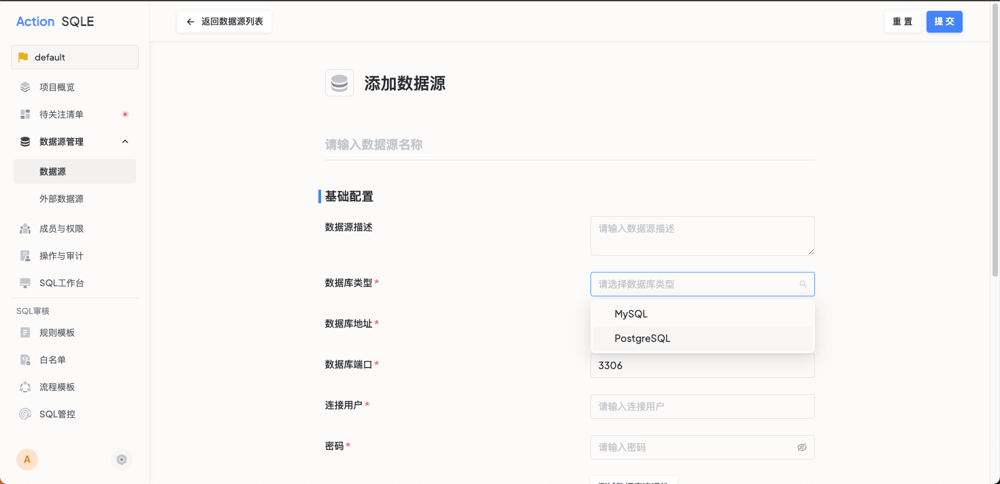

在本篇文档中，会介绍如何开发一个数据库审核插件，分为快速开始部分和详细部分。
* 如果你是一个对 Go 语言不太了解的人，可以先通过[快速开始](#快速开始)部分的文档，实现一个简单的数据库审核插件。
* 当你对插件开发有了一定的了解之后，可以通过[详细](#二详细部分)部分的文档，通过更多自定义的方式，实现更加复杂的数据库审核插件。

## 快速开始
### 前置
#### 1. 语法
由于 SQLE 是一个用 Go 语言开发的开源项目，如果你对 Go 语言完全不了解，需要先了解 Go 语言的基础语法，建议使用官方的 Go 语言快速开始文档（Go Tour 或者 Go 语言之旅），如果你已经了解了 Go 语言的基础语法，可以直接跳过本部分。
#### 2. 包管理
SQLE 插件是一个独立于 SQLE 的进程，所以编写插件的方式与开发一个新的 Go 语言项目并没有什么差异。Go 语言项目使用 Go Modules 来管理包，所以在开始之前你需要先了解一下 Go Modules 的使用方法。建议参考这篇文档，文档中大致介绍了如果开始一个新的 Go 语言项目，并通过 Go Modules 的方式来调用其他项目的包，如果你已经了解了 Go Modules 的使用方法，可以直接跳过本部分。
#### 3. Go语言项目构建

### 编写插件
这一小节会假设你已经创建了一个由 Go Modules 管理的审核插件项目。下面开始介绍插件核心代码的开发。
#### 1. 数据库插件介绍
SQLE 为了方便插件的开发，在自身的插件层之上做了一层封装（Adaptor），插件开发者可以使用这个封装库来快速的开发一个数据库审核插件。

在开发之前，你需要先引入 SQLE：
```
go get github.com/actiontech/sqle@v2.2305.0-pre2 # 此版本为该文档编辑时的最新版本
```
选择 SQLE 中两个库插件相关的库：

* github.com/actiontech/sqle/sqle/driver
* github.com/actiontech/sqle/sqle/pkg/driver

:::tip
* 第一个库定义了插件规则的结构体，在你编写插件规则时需要用到这个库。
* 第二个库中实现了一些默认的插件，在引入这个库后，只需要实现相应的规则与规则处理函数即可。其中三个默认的插件为：
  * PostgreSQL
  * Oracle
  * SQL Server
* 如果这三个默认的插件不能满足需求，可以自己实现一个插件，参考本篇文档[自定义插件](#2自定义插件)小节。
:::


  


#### 2. 选择插件
下面假设你想要实现一个 SQL Server 的审核插件。在 main 函数中创建一个空的 SQL Server 审核插件，这时你的 main 文件应该是这样的：
```
package main

import (
    "github.com/actiontech/sqle/sqle/driver"
    adaptor "github.com/actiontech/sqle/sqle/pkg/driver"
)

func main() {
    plugin := adaptor.NewAdaptor(&adaptor.MssqlDialector{})
}
```

#### 3. 编写插件规则与规则处理函数
假设你需要实现一个规则，该规则检查 SQL 是否使用了 select *。定义规则如下：
```
Rule{
    Name:     "aviod_select_all_column", # 规则ID，该值会与插件类型一起作为这条规则在 SQLE 的唯一标识
    Desc:     "避免查询所有的列", # 规则描述
    Category: "DQL规范", # 规则分类，用于分组，相同类型的规则会在 SQLE 的页面上展示在一起
    Level:    driver.RuleLevelError, # 规则等级，表示该规则的严重程度。在插件注册阶段，会使用所有 RuleLevelError 级别的规则创建一个默认的规则模板。
}
```
规则的处理函数如下：
```
func(ctx context.Context, rule *driver.Rule, sql string) (string, error) {
    if strings.Contains(sql, "select *") {
        return rule.Desc, nil
    }
    return "", nil
}
```
这里为了演示，这个处理函数只是简单的使用了字符串匹配的方式，你也可以使用正则或者 AST 语法树的方式来检查 SQL 语句（AST 的方式会在[自定义SQL解析器](#1自定义sql解析器)一小节中介绍）。

最后将插件规则与规则处理函数通过 `plugin.AddRule()`函数注册到 SQLE 中，注册完成后，你的 main 文件应该是这样的：
```
package main

import (
    "github.com/actiontech/sqle/sqle/driver"
    adaptor "github.com/actiontech/sqle/sqle/pkg/driver"
)

func main() {
    plugin := adaptor.NewAdaptor(&adaptor.MssqlDialector{})
    aviodSelectAllColumn := &driver.Rule{
        Name:     "aviod_select_all_column",
        Desc:     "避免查询所有的列",
        Category: "DQL规范",
        Level:    driver.RuleLevelError,
    }
    aviodSelectAllColumnHandler := func(ctx context.Context, rule *driver.Rule, sql string) (string, error) {
        if strings.Contains(sql, "select *") {
            return rule.Desc, nil
        }
        return "", nil
    }
    plugin.AddRule(aviodSelectAllColumn, aviodSelectAllColumnHandler)

    ////////////////////////////////////////////
    // ... 编写更多规则并通过 AddRule 注册到 SQLE 中
    ////////////////////////////////////////////

    // 最后关键一步，调用 `plugin.Serve()` 启动插件：
    plugin.Serve() 
}
```

#### 4. 构建并使用插件
和通常的程序编写流程一样，编写完插件代码后，需要将其构建成二进制文件，然后才能将其注册到 SQLE 中。执行 `go build -o ${二进制名} main.go` 将插件代码构建成二进制文件。最后参考数据库审核插件使用 来使用你的自定义插件。


### 自定义部分
#### 1.自定义SQL解析器
前面介绍的审核规则都是通过字符串匹配的方式来解析 SQL 的内容。这种方式适合规则较少且 SQL 简单的情况下使用。

如果需要对 SQL 进行更复杂的解析匹配，恰好你选择的数据库插件又有相应的 SQL 解析器，这时可以使用自定义 SQL 解析器的方式来编写插件。

首先通过调用 `WithSQLParser()` 注册自己的 SQL 解析器。在添加规则时则使用 `plugin.AddRuleWithSQLParser()` 添加带有解析器的处理函数。在处理函数中，将 interface{} 断言成具体的 AST 语法树，通过语法树级别的操作来更加精细的处理 SQL。PostgreSQL 提供了基于 cgo 调用的解析器（见：PostgreSQL SQL 解析器），下面的代码展示了如何写一个 SQL 解析器的插件：
```
func main() {
    plugin := adaptor.NewAdaptor(&adaptor.PostgresDialector{})

    // 依然是定义规则
    aviodSelectAllColumn := &driver.Rule{
        Name:     "aviod_select_all_column",
        Desc:     "避免查询所有的列",
        Category: "DQL规范",
        Level:    driver.RuleLevelError,
    }

    // 依然是定义处理函数，这时处理函数的参数是 interface{} 类型，需要将其断言成 AST 语法树。
    aviodSelectAllColumnHandler := func(ctx context.Context, rule *driver.Rule, ast interface{}) (string, error) {
        node, ok := ast.(*parser.RawStmt)
        if !ok {
            return "", errors.New("ast is not *parser.RawStmt")
        }

        switch stmt := node.GetStmt().GetNode().(type) {
        case *parser.Node_SelectStmt:
            for _, target := range stmt.SelectStmt.GetTargetList() {
                column, ok := target.GetResTarget().GetVal().GetNode().(*parser.Node_ColumnRef)
                if !ok {
                    continue
                }
                for _, filed := range column.ColumnRef.GetFields() {
                    _, ok = filed.GetNode().(*parser.Node_AStar)
                    if ok {
                        return rule.Desc, nil
                    }
                }
            }
        }
        return "", nil
    }

    // 依然是注册规则，与前面的例子不同的是，这时使用的是 `plugin.AddRuleWithSQLParser()` 。
    plugin.AddRuleWithSQLParser(aviodSelectAllColumn, aviodSelectAllColumnHandler)

    // 依然是启动插件，与前面的例子不同的是，需要将 SQL 解析的方法注册到插件中。
    plugin.Serve(adaptor.WithSQLParser(func(sql string) (ast interface{}, err error) {
        // parser.Parse 使用 PostgreSQL 的解析器，将 sql 解析成 AST 语法树。
        result, err := parser.Parse(sql)
        if err != nil {
            return nil, errors.Wrap(err, "parse sql error")
        }
        if len(result.Stmts) != 1 {
            return nil, fmt.Errorf("unexpected statement count: %d", len(result.Stmts))
        }

        // 将 SQL 的语法树返回。
        return result.Stmts[0], nil
    }))
}
```

#### 2.自定义插件
如果 driver 包中默认的 PostgreSQL、Oracle 与 SQL Server 插件不能满足你的需求的话，你也可以自定义一个数据库插件。方法就是实现一个接口：
```
type Dialector interface {
    Dialect(dsn *driver.DSN) (driverName string, dsnDetail string)
    ShowDatabaseSQL() string
    String() string
}
```

在实现这个接口前，你需要先了解一下 Go 语言原生 Driver 的概念（以 MySQL Driver 为例）。

下面介绍 Dialector 接口的含义：

* `Dialect`：实现该方法，通过 DSN 提供的 Host Port User Password Database 信息和你选择的数据库 driver，构造出 driverName 与 dsnDetail。driverName 是你引入的数据库 driver 名称；dsnDetail 是连接数据库驱动的必要信息。这两个参数最终会通过 `sql.Open()` 来创建一个数据库连接。
* `ShowDatabaseSQL`：实现该方法，可以自定义你数据源中默认展示的数据库列表，该数据库列表最终会展示在工单审核列表的数据库下拉框中，如下图：
  
* `String`：实现该方法，该方法的返回值会作为你实现的数据库审核插件名展示在 SQLE 的相关下拉框中，如下图：
  

将你的实现作为 NewAdaptor 的参数传入即可，后续的步骤与前面规则相关的介绍一致。

## 详细
### SQLE与插件的交互图

### 插件接口说明
#### 1.注册接口说明
该接口定义了该插件的名称和实现的规则，SQLE启动的时候会调用该接口获取插件名称和该插件支持的规则列表。
```
type Registerer interface {
    Name() string
    Rules() []*model.Rule
}
```
* `Name`: 插件名，最终会展示在 SQLE 页面的数据源类型的下拉框中；
* `Rules`: 插件支持的规则，在启动 SQLE 时，会调用插件获取这些规则，你将在规则模板内看到它们。

#### 2.审核接口说明
该接口定义了SQLE进行审核时，由插件完成的和具体数据库底层交互的操作
```
type Driver interface {
    Close(ctx context.Context)
    Ping(ctx context.Context) error
    Exec(ctx context.Context, query string) (driver.Result, error)
    Tx(ctx context.Context, queries ...string) ([]driver.Result, error)
    Schemas(ctx context.Context) ([]string, error)
    Parse(ctx context.Context, sqlText string) ([]Node, error)
    Audit(ctx context.Context, sql string) (*AuditResult, error)
    GenRollbackSQL(ctx context.Context, sql string) (string, string, error)
}
```
* `Close`: 关闭审核插件使用的相关资源，通常是完成一次审核后，关闭数据库连接等资源;
* `Ping`: 检测数据库的连接性,通常在添加数据源时，为了检测填写的数据是否正确，会调用此方法;
* `Exec`: 执行 SQL 上线时执行此方法；
* `Tx`: 执行 SQL 上线时执行此方法，一般当SQL是DML时且需要事务执行时会批量执行SQL；
* `Schemas`: 返回审核插件展示给用户的 Schema 列表；
* `Parse`: 解析审核插件支持的 SQL 格式；
* `Audit`: 根据指定的SQL语句生成审核建议；
* `GenRollbackSQL`: 生成 SQL 的回滚语句。

#### 3.插件的配置信息说明
```
type Config struct {
    DSN           *DSN
    Rules          []*Rule
}
```
* `DSN`: 数据源信息, 待审核的数据库；
* `Rules`: 本次审核制定的规则列表。

#### 4.初始化函数说明
插件的主进程入口，由插件的 main 函数调用即可实现插件
```
func ServePlugin(r Registerer, newDriver func(cfg *Config) Driver)
```
* `r`: 传入 Registerer 的接口实现, 由插件侧实现；
* `newDriver`: 传入 Driver 的初始化函数，该函数的入参是 Config 是由 SQLE 向插件传递的配置信息，函数的出参是 Driver 的接口实现，由插件侧实现。