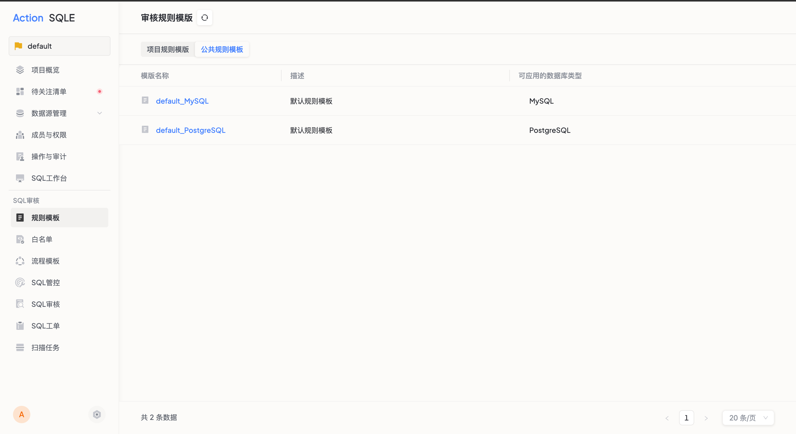
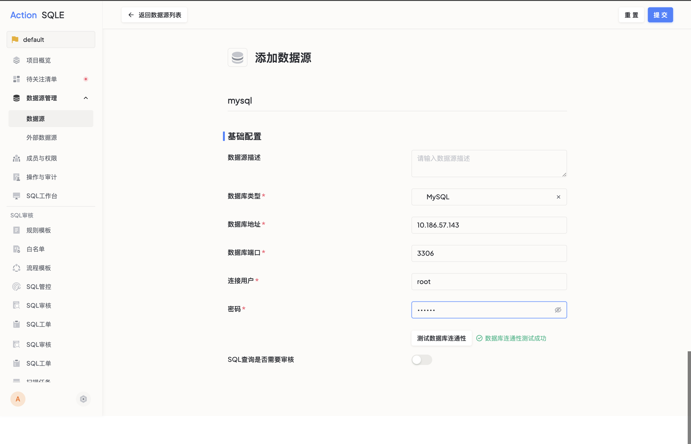
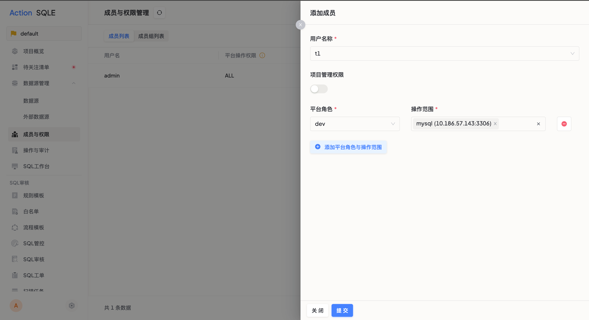
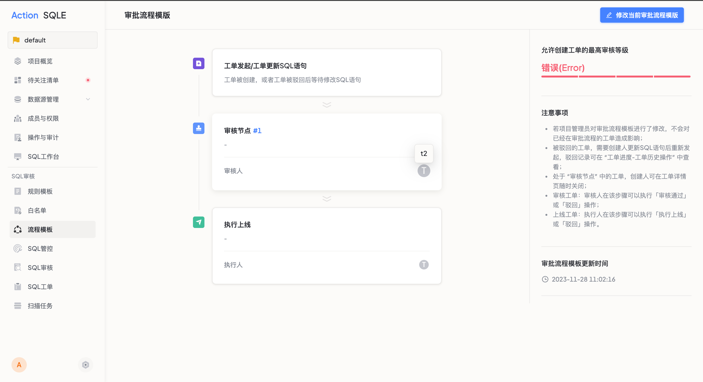
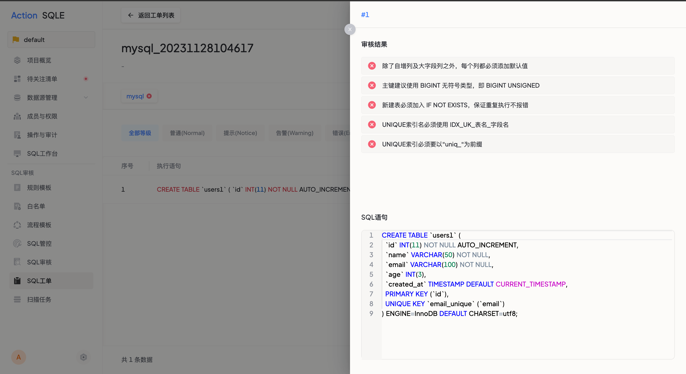
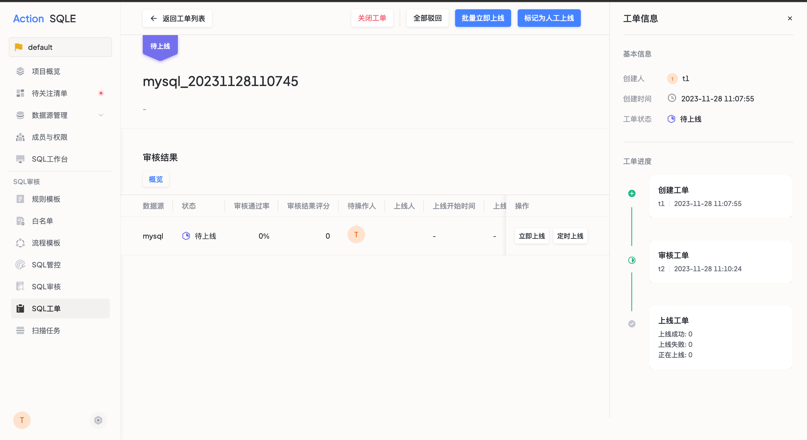
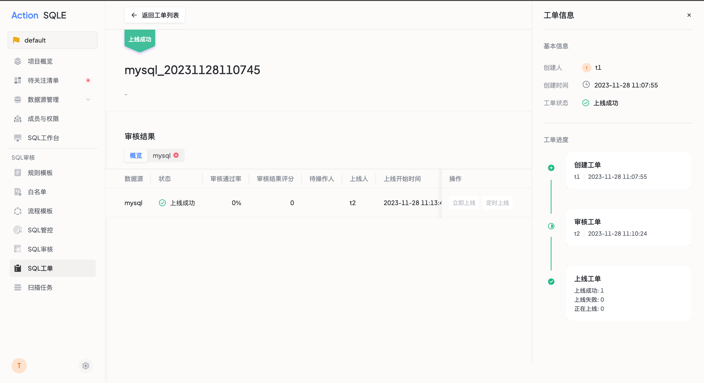

# 快速开始
本文的目的是让大家能快速体验SQLE的基础功能，帮助大家快速上手SQLE。下面将模拟一个简单的日常SQL上线场景，开发人员提交SQL，DBA进行SQL审核并上线，大概的步骤如下：
1. 管理员 admin 添加全局用户 t1 和 t2；
2. 管理员 admin 添加全局角色 dev 和 dba；
3. 管理员 admin 配置项目资源：
   * 给项目配置SQL审核规则；
   * 给项目添加数据源；
   * 给项目配置人员 t1 和 t2；
1. t1 作为开发人员提交SQL审核并创建工单；
2. t2 作为 DBA 进行审核并上线。
## 搭建环境
首先参考[部署文档](./deploy-manual/intro.md)快速搭建一个SQLE服务。
## 配置资源
### 创建全局用户
使用 admin 用户进入用户中心界面添加全局用户 t1 和 t2；点击左侧菜单栏右下家的全局设置-用户中心进入。

### 创建全局角色
使用 admin 用户进入用户中心界面添加全局角色 dev 和 dba，使得 dev 至少具备权限`创建/编辑工单`, dba 至少具备权限`查看他人创建的工单`，`审核/驳回工单`，`上线工单`。

### 给项目配置SQL审核规则
使用 admin 用户进入项目界面，根据自身公司的审核标准配置审核规则，本次试用不再新建规则模版，将使用提供的全局默认规则模版进行测试。如何设置规则模版，参考：[规则模版](./user-manual/project/rule-template-manager.md)。

### 给项目创建数据源
使用 admin 用户进入项目界面，录入一个MySQL类型的数据源 `mysql`，并可以绑定上一步骤中创建的规则模版，这里绑定系统内置的全局默认规则模版。如何管理数据源，可参考：[数据源](./user-manual/project/instance-manager.md)。

### 给项目添加成员
使用 admin 用户进入项目界面，给项目添加成员，本次的重点是要将上述创建的全局用户添加到项目内，给用户 t1 授予数据源 `mysql` 上的 `dev` 角色，给用户 t2 授予数据源 `mysql` 上的 `dba` 角色。

### 给项目配置审批流程模板
使用 admin 用户进入项目界面，给项目变更审批流程模板，指定t2作为审核人和上线人。

## SQL 上线
### 开发用户 t1 提交工单
使用 t1 用户进入项目界面，点击创建工单即可对项目内授权过的数据源进行SQL审核上线。

:::caution
当我们提交下图所示的SQL时，自动审核触发了审核建议，则此时工单无法提交需要修改SQL符合规范后再次提交。
:::

:::tip
按要求优化SQL后，提交工单。
:::

### DBA用户 t2 上线
使用 t2 用户进入项目界面，进入由t1提交的上线工单，点击审批通过。

点击批量立即上线，完成SQL上线操作。

:::tip
SQLE 支持通过邮件，微信企业号等途径推送工单通知。也可以配置工单对接，在钉钉、飞书上进行工单审批
:::
