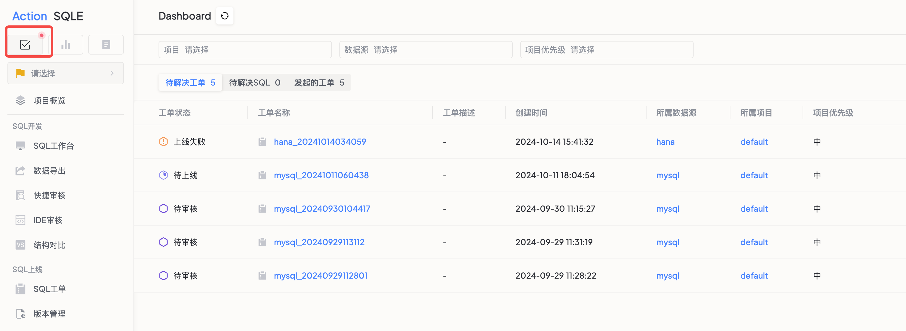

全局待关注清单功能旨在帮助业务操作人员和项目管理人集中管理多个项目的审批和SQL问题，提高工作效率和响应速度。

### 功能亮点

* 审批效率提升： 一站式查看所有项目的待处理工单，无需在不同项目间切换。
* SQL问题追踪： 快速识别并优化各项目中的SQL问题，确保问题不被遗漏。

### 操作步骤
点击页面左上角的全局dashboard按钮，查看当前待处理的内容
* 待处理的工单，可以点击跳转
* 待处理的SQL，可以点击查看

**1. 访问全局Dashboard：**

* 点击页面左上角的全局Dashboard按钮，即可查看当前所有待处理的内容。

**2. 查看待处理工单：**

* 在待处理工单面板中，用户可以一目了然地查看所有项目的待处理工单，包括待审批、待上线的工单。
* 点击任意工单，即可直接跳转至详细审批页面，进行快速审批操作。

**3. 查看待解决SQL问题：**

* 在待解决SQL面板中，用户可以跟踪和排查各项目中存在的SQL问题，这些问题SQL来源于SQL管控中超过预定标准的SQL。
* 点击具体的SQL问题，即可查看详细信息，并进行针对性的优化。

