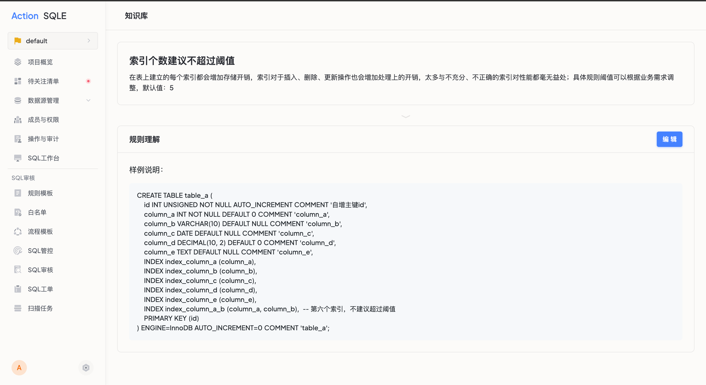

## 使用场景
规则知识库是用于帮助用户理解规则背景、原理、优化建议以及规范SQL示例的页面。通过规则知识库，用户可以更深入和全面地了解规则，以实现更高效的开发和优化工作。

## 使用入口

1. 在系统设置中点击`查看规则`，点击具体规则，再点击`规则知识库`标签下的`查看更多`按钮，即可进入规则知识库详情；
2. 在SQL审核、工单、扫描任务详情页面中，点击触发的规则说明后的`查看更多`按钮，即可进入规则知识库详情；

## 范围

规则知识库目前支持内置规则和自定义规则的编辑和查看。

## 编辑步骤

### 限制

目前，只有平台管理员具有规则知识库的编辑权限，以确保知识库中的信息准确且权威。

### 编辑

平台管理员可以按照以下步骤编辑规则知识库内容：

1. 登录平台并进入规则知识库页面，入口可以参考[使用入口](#使用入口)
2. 点击'编辑'按钮，即可修改规则对应的知识库内容。

### 操作结果

:::tip
目前，平台已为MySQL和TDSQL两种数据库类型的规则填充了规则知识库，并正致力于为其他数据库类型提供相应的知识库内容。
:::