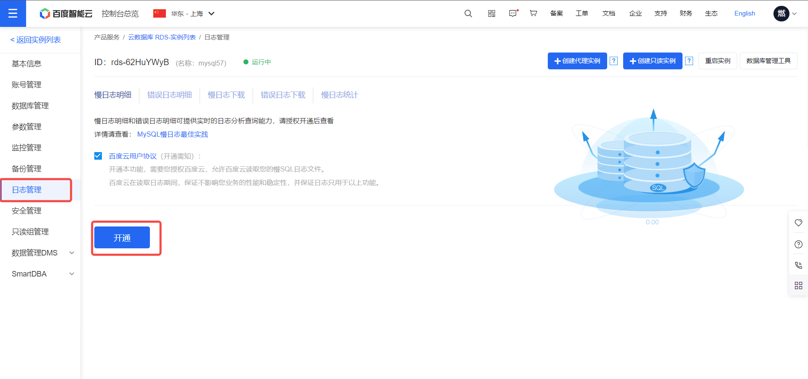
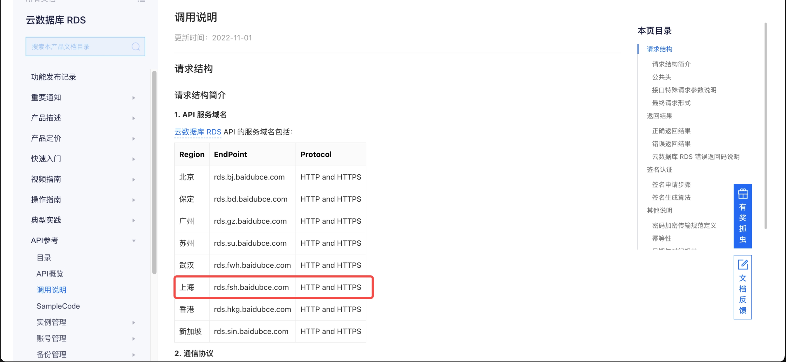

当使用百度云RDS实例，并且想要监管实例上产生的慢SQL，可以通过创建一个百度云RDS慢日志扫描任务来实现。该任务将会定期扫描百度云RDS实例上的慢日志，并将扫描结果发送到SQLE中进行分析。

### 支持的数据源类型
* MySQL

### 前置操作
* 用户需创建双机高可用版本的百度云RDS实例；
* 对该实例开通慢日志；
* 已在平台添加对应数据源。

### 步骤一 开启百度云慢日志扫描类型

在SQL管控配置中为数据源开启智能扫描，扫描类型选择“百度云慢日志扫描”，并填写以下字段信息：

* 实例ID：填写百度云RDS实例的ID。
* Access Key：为账号安全认证中的Access Key，用于登录百度云RDS，需要与Secret Key一同使用。
* Access Secret Key：账号安全认证中Access Key对应的Secret Key。
* 启动任务时拉取慢日志时间范围(单位:小时,最大7天)：扫描任务读取慢日志的时间范围，单位为小时，最大范围为7天。
* 审核过去时间段内抓取的SQL（分钟）： 审核该时间段内抓取到的慢SQL。
* RDS Open API地址：RDS的地址前缀，用以调用RDS服务，需根据实例所在区域进行填写。如当前实例在华东-上海范围，则应填写rds.fsh.baidubce.com
* 审核规则模板：选择对应的审核规则模板；

以下为百度云RDS Open API地址参考：

点击`提交`，完成数据源上的百度云慢日志SQL扫描任务配置。

### 步骤二 获取采集结果及审核结果
在扫描详情中查看采集的百度云慢日志SQL信息及审核结果。

