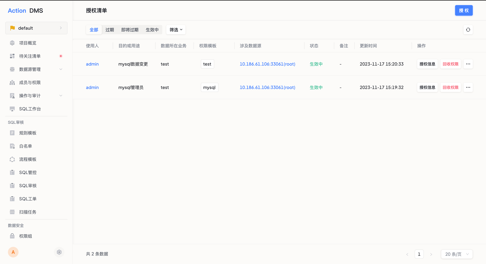

# 授权清单

通过统一分配指定权限操作用户，避免出现因业务多导致权限管理分散的困境，同时追溯权限发放原因。

### 使用场景
在数据库权限的发放过程中，通常需要进行追溯和审计，特别是对于安全要求较高的系统。授权清单功能可以追溯记录权限发放的详细信息，如授权模板、有效期、授权目的、备注等，以满足对权限发放过程的审计和跟踪需求，保障系统的安全性和合规性。

### 前置条件
在执行授权清单操作之前，请确保已完成以下步骤：
* 已添加权限模板；
* 已添加成员；

### 操作步骤

**步骤一：进入授权清单列表并点击授权**

**步骤二：填写授权基本信息**

* 选择授权模板
  * 选择权限模板
  * 设置授权有效期
* 配置授权目的
  * 选择使用人
  * 输入授权目的或用途
  * 填写授权备注信息
* 新建数据库连接账号
  * 输入连接账号名
  * 输入连接域
  * 输入连接密码并确认

完成以上步骤后，点击确认，即可完成当前的授权操作。

### 执行结果
授权操作完成后，您将在授权清单列表中看到相应的执行结果。可以参考下方的示意图

### 更多操作
除了上述的基本操作之外，还可以进行以下操作：
* 回收权限：回收当前授权产生的数据库连接账号，绑定用户不再拥有权限模板中的数据操作能力；
* 续期授权：延期数据库连接账号的可用时间；

