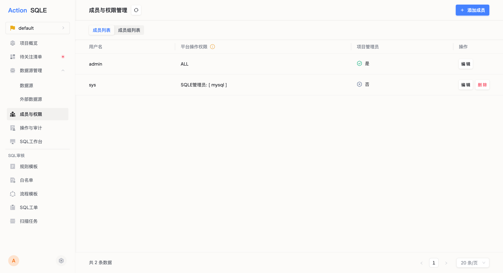
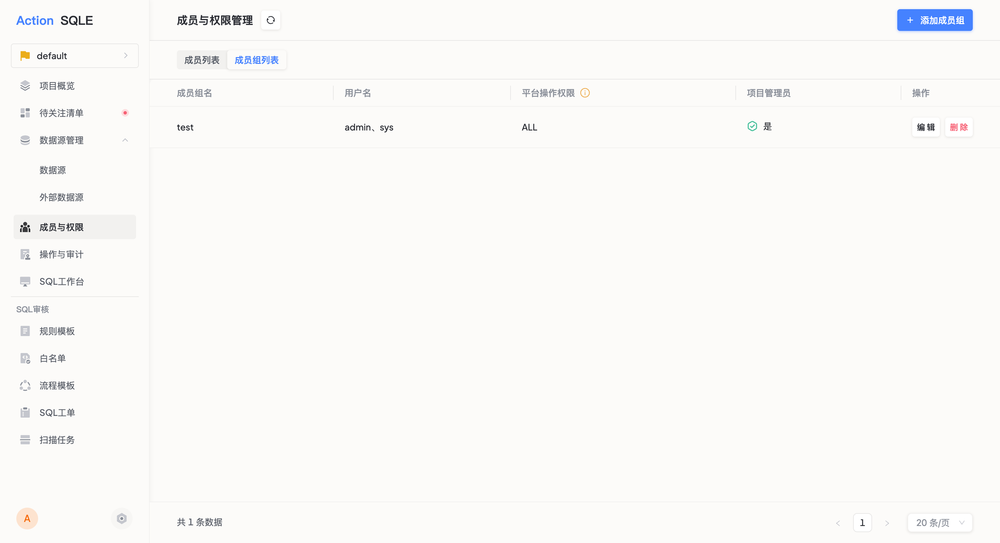

本文介绍项目内添加成员、成员组的步骤，以及其他管理操作。

## 前置条件
* 项目管理员进入指定的项目；
* 平台管理员已完成用户的添加；
* 平台管理员已完成角色的添加；

## 成员管理

成员由项目管理员添加，只有被添加为成员后，才可查看、操作项目内资源。

### 使用场景
* 一个业务以项目的形式管理SQL工单、扫描任务等资源，若用户需要在指定项目中执行SQL工单、扫描任务等相关操作，则需要成为该项目的成员，并具有相应角色操作权限。

### 添加成员

#### 步骤
项目管理员点击`成员`标签，点击`添加成员`按钮；

#### 字段说明
* 用户名：选择平台已添加的用户；
* 选择是否为项目管理员：项目管理员将负责项目管理行为，例如添加数据源和成员等；
    * 若将当前成员设为项目管理员，则该成员将对项目内所有数据源拥有所有操作权限，无需额外配置权限；
    * 若未设置，则当前成员在项目内的操作权限将根据下一步`添加角色与数据源的绑定`获得；
* 添加角色与数据源的绑定；
    * 添加数据源：指定当前成员能操作的数据源；
    * 添加角色：指定当前成员在该数据源上的角色权限，角色设置请参见[角色管理](../user-manager/role.md)；
* 删除角色与数据源的绑定；

#### 执行结果
项目管理员可查看当前项目中添加的成员列表。

#### 后续步骤
配置项目审核流程模板：可以指定成员作为审核/上线环节的操作人，请参见[审核流程模板](rule-template-manager.md)。

#### 更多操作
* 编辑成员：添加成员后，项目管理员可修改成员可用的数据源及对应角色权限；
    * 限制：编辑之前产生的工单不受影响，编辑之后工单创建时将应用最新的数据源及权限对应关系；
* 删除成员：项目管理员可删除项目中的成员；
    * 限制：若成员已不在项目内，则无权操作工单；

## 成员组管理

### 使用场景
* 如果若干用户在项目内具备相同的操作权限或访问权限，可以通过将他们加入同一个成员组来配置他们对项目资源的权限。

### 添加成员组

#### 步骤
项目管理员点击`成员组`标签，点击`添加成员组`按钮；

#### 字段说明
* 成员组名：填写成员组的名称；
* 用户名：选择需要加入为组员的用户；
* 选择是否为项目管理员：项目管理员将负责项目管理行为，例如添加数据源和成员等；
    * 若将当前成员设为项目管理员，则该成员将对项目内所有数据源拥有所有操作权限，无需额外配置权限；
    * 若未设置，则当前成员在项目内的操作权限将根据下一步`添加角色与数据源的绑定`获得；
* 添加角色与数据源的绑定；
    * 添加数据源：指定当前成员能操作的数据源；
    * 添加角色：指定当前成员在该数据源上的角色权限，平台默认提供DEV、DBA两种角色，负责SQL语句的提交、审核及上线操作；更多角色设置请参见[角色管理](../user-manager/role.md)；
* 删除角色与数据源的绑定；

#### 执行结果
项目管理员可查看当前项目中添加的成员组列表。

#### 后续步骤
* 配置项目审核流程模板：可以批量匹配具有同一权限的成员作为审核/上线环节的操作人，，请参见[审核流程模板](rule-template-manager.md)。

#### 更多操作
* 编辑成员组：添加成员组后，项目管理员可修改成员组可用的数据源及对应角色权限；
    * 限制：编辑之前创建的工单不受影响，之后创建的工单将依据新的数据源及权限；
* 删除成员组：项目管理员可删除项目中的成员组；
    * 限制：若成员组内成员已不在项目内，则无权操作工单；