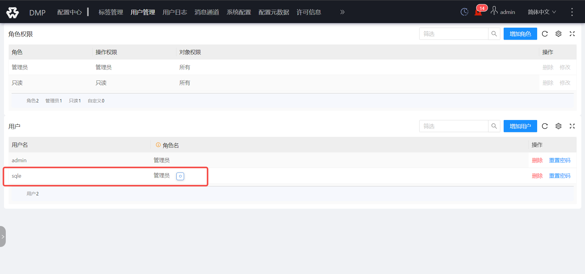
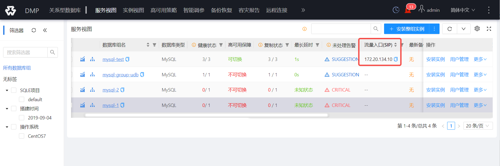
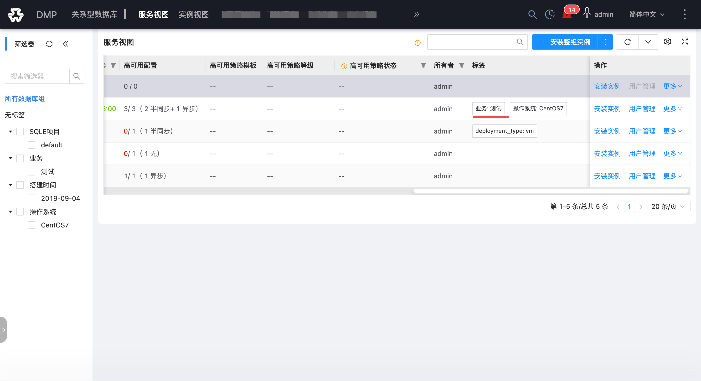
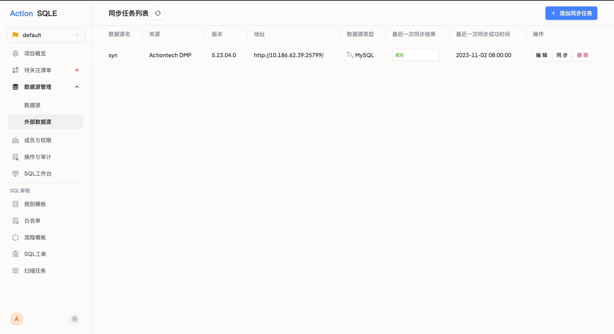
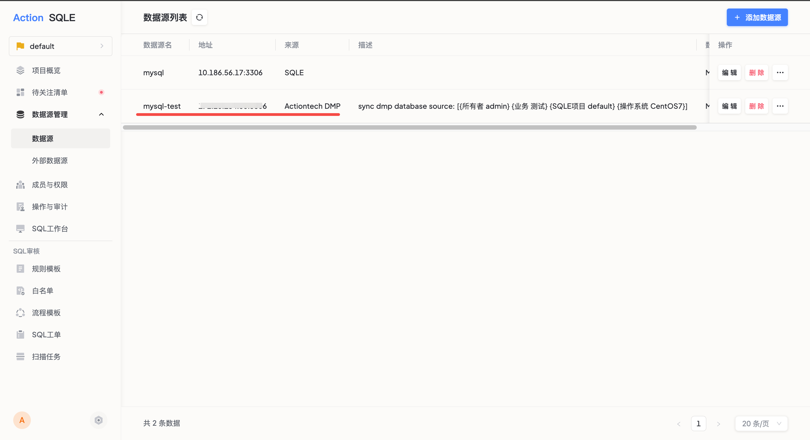

# 外部数据源同步
SQLE支持从其他平台导入数据源的功能，方便用户接入外部平台的数据源，目前已实现对接爱可生商业产品“云树·DMP：数据库集群管理平台”。

:::tip
版本限制：目前仅支持DMP5.23.04.0及以上版本
:::

### 使用场景
如果用户需要使用SQLE对其他既有平台上的数据源进行SQL管理，只需要在SQLE上创建同步任务，将外部平台的数据源同步至SQLE平台，无需在两个平台上重复添加。

### 前置条件

* 需要在外部数据源上配置同步用户；
* 为需要同步的数据源组绑定SIP；
* 为需要同步的数据源组配置同步时所需的业务标签；

#### 1.添加同步用户
平台添加用户sqle，密码sqle，并赋予管理员权限。

#### 2.针对需要同步的实例组添加SIP流量入口
为需要同步的数据源组，添加SIP，目前SQLE只会同步配置了SIP的数据源组。

#### 3.针对需要同步的实例组添加项目标签
为需要同步的数据源组，添加`业务`标签，SQLE同步时，将依据项目标签值，将实例同步至指定项目中，并赋予指定业务属性。

### 操作步骤
* 进入SQLE平台，展开`数据源管理`，点击`外部数据源同步`，进入同步任务页面
* 添加同步任务，填写以下相关信息
    * 来源：目前仅支持DMP平台；
    * 地址：默认格式为http://ip:port；
    * 数据源类型：选择需要同步的实例对应的数据源类型，如MySQL；
    * 审核规则模板：选择数据源使用的规则模板；
    * 设置同步间隔：SQLE平台将按照指定的同步时间执行数据源同步任务；
* 点击`提交` 按钮，SQLE会立即进行一次数据源同步。

### 操作结果
同步成功后进入对应项目，查看数据源列表页面，可以看到DMP上配置了SIP的数据源组已经被添加到SQLE平台，可以对这个数据源进行创建工单或创建扫描任务等操作。

### 后续操作
管理员可编辑或删除同步任务，也可在同步周期之外，手动执行同步任务。