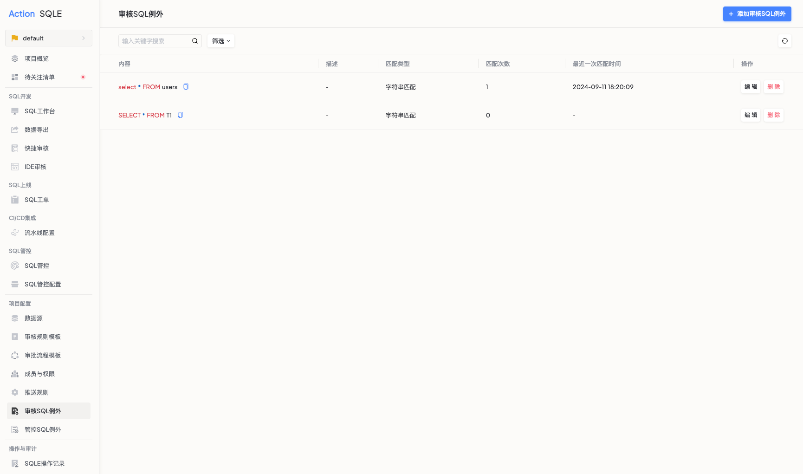
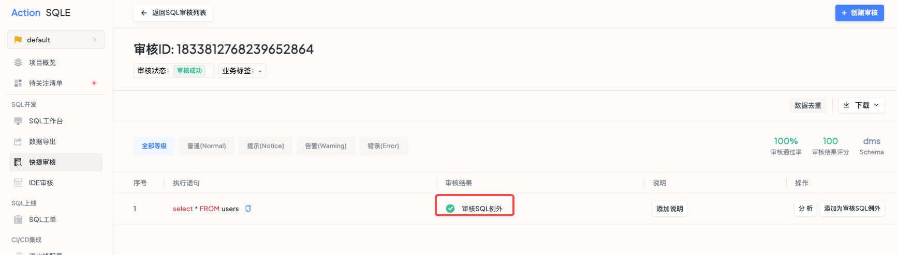

# 审核SQL例外`企业版`

在企业版中，SQLE提供了一个强大的功能——审核SQL例外，它允许用户在特定情况下忽略SQL规范审核中的规则。这项功能特别适用于那些存在不规范之处但暂时无法解决的SQL语句。

添加在SQL审核审核SQL例外中的语句，在提交SQL规范审核时，不受审核规则的约束。

:::tip
审核SQL例外目前支持两种方式匹配SQL：字符串匹配和SQL指纹匹配
* 按字符串匹配：精确匹配整个SQL查询，包括所有字符、空格和注释。
* 按SQL指纹匹配：通过分析SQL查询的结构特征生成唯一标识符（指纹），用于识别和比较查询。
:::
    

### 前置条件
对SQL进行审核时，触发了高等级的规则告警，但是暴露的SQL问题并非当前能够解决，需要暂时忽略。

### 操作步骤

#### 访问审核SQL例外
* 项目管理员可以通过点击左侧导航栏的审核SQL例外菜单进入。

#### 添加审核SQL例外
* 点击列表右上角的添加审核SQL例外按钮。
* 选择匹配模式：
  * 选择字符串匹配或SQL指纹匹配。
* 输入描述：提供该审核SQL例外的应用场景描述。
* 输入SQL语句：输入需要添加的SQL语句。

####  查看和执行
成功添加审核SQL例外后，您可以在当前项目中查看所有的项目审核SQL例外及其匹配模式。

审核对应的SQL语句时，如果匹配到审核SQL例外，审核结果处将出现`审核SQL例外`的提示。

