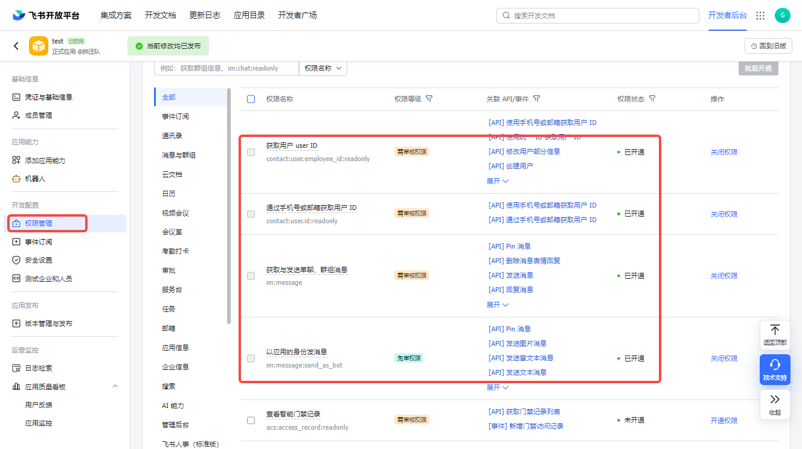
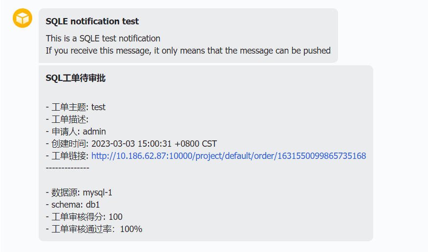
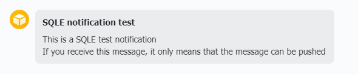
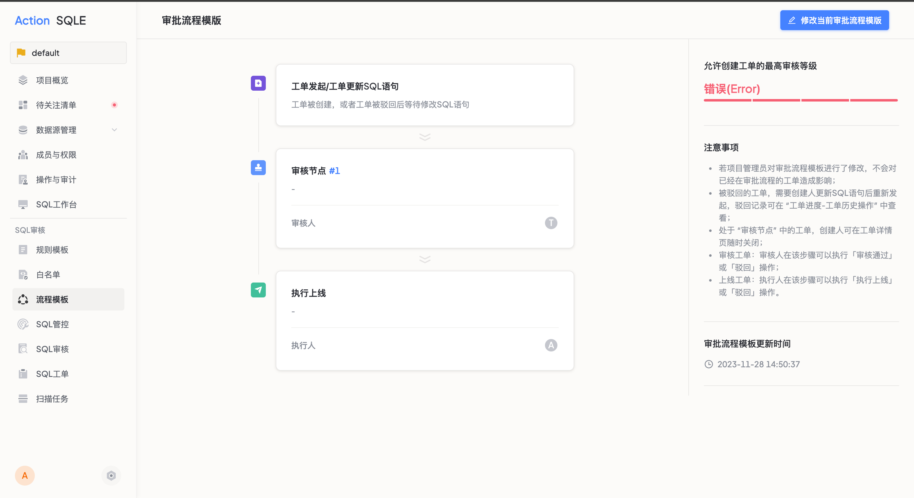
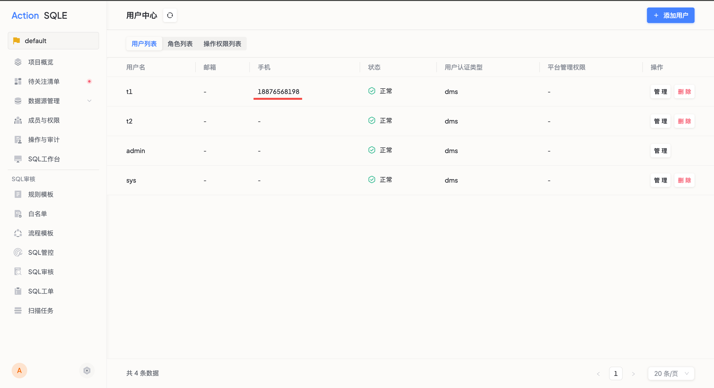
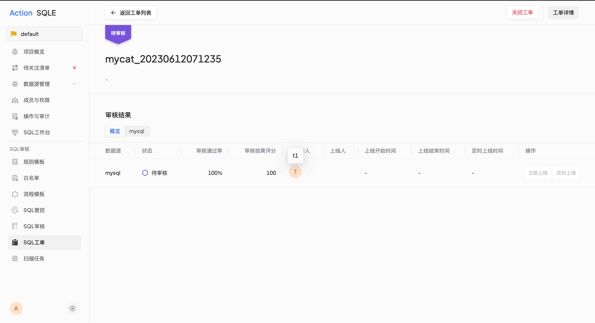
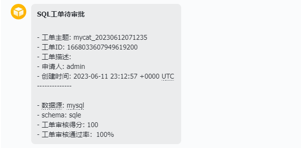
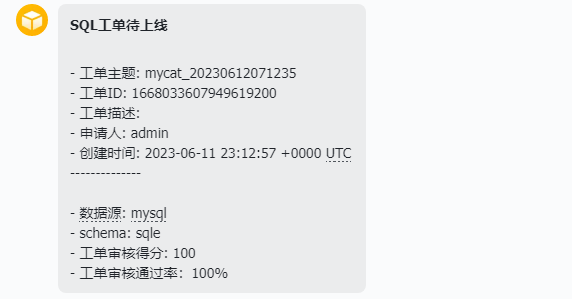
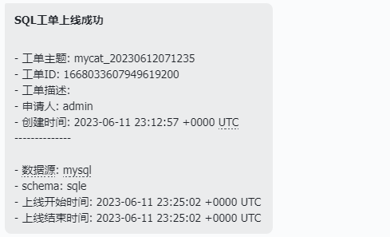

# 消息推送
当前支持将工单状态变更同步至邮箱、企业微信、飞书、Webhook。

## 使用场景
在工单流转过程中，当需要将工单状态变更通知到对应操作人时，可以开启对应的消息推送服务，便于相关人员通过第三方应用程序及时看到SQLE工单状态变更的通知，避免因未能及时登录平台确认工单状态造成的进度滞后。

## 入口
管理员账号，进入击系统设置页面后，点击`消息推送`标签。

## 推送方式
### SMTP邮箱推送

#### 前置操作
配置SMTP信息时，需要对开通邮件传输的邮箱进行相关设置，在账户管理中开启SMTP。

#### 操作步骤
点击修改，选择是否启用邮件推送
* 选择启用，工单状态变更后会发送邮件通知, 邮件通知启停不会影响其他通知方式，须填写以下信息
    * SMTP 地址：SMTP 服务器地址，如 smtp.163.com
    * SMTP 端口：SMTP 服务器端口，如 25
    * SMTP 用户名：完整的邮箱用户名
    * SMTP 密码：该用户名的授权码（非邮箱用户密码）
    * 确认SMTP密码

#### 后续操作
* 点击`测试`，输入邮箱地址并确认后，将在邮箱中收到测试邮件；
* 开启邮箱推送方式后，一旦工单状态发生变更，工单相关人员可在账号关联的邮箱中收取工单推送信息。

### 企业微信推送

#### 前置操作
* 用户需要创建一个企业微信应用
* 需要在该应用中配置企业可信IP

:::tip
仅白名单内的IP地址可调用企业微信接口,具体配置方法可参考[官方文档](https://developer.work.weixin.qq.com/document/path/95672)。
:::

#### 操作步骤
* 若选择启用，工单状态变更后会发送企业微信通知, 企业微信通知启停不会影响其他通知方式，须填写以下信息：
    * CorpID(微信企业号ID)：必填，为企业ID
    * CorpSecret(CorpID对应密码)：必填，为当前应用的密码
    * 企业微信应用ID：必填，为当前应用的agentid
    * 是否开启加密传输：若打开加密传输，则推送形式为通知，需要点击查看推送通知详情；若关闭加密传输，则推送形式类似于对话弹窗，无需点击查看详情；
    * 代理服务器IP：企业微信代理服务器IP

#### 后续操作
* 点击测试, 输入测试用企业微信用户ID, 点击测试；
* 开启企业微信推送方式后，一旦工单状态发生变更，工单相关人员可在账号关联的企业微信账号中收取工单推送信息。

### 飞书推送

#### 前置步骤
* 用户需要创建企业应用， 开通机器人功能，可参考[飞书官方文档](https://open.feishu.cn/document/client-docs/bot-v3/add-custom-bot)
* 需要为该应用开启如下权限

#### 操作步骤
点击修改，选择是否启用飞书推送通知
* 若选择不启用，无需填写
* 若选择启用，工单状态变更后会发送飞书推送通知, 飞书推送通知启停不会影响其他通知方式，须填写以下信息
    * App ID
    * App Secret

:::tip
AppID及Secret来自于[飞书应用凭证](https://open.feishu.cn/document/server-docs/api-call-guide/calling-process/get-access-token)
:::

#### 后续操作
* 点击测试, 输入测试用手机号/邮箱，若配置正确，该测试账号将收到一则验证通知；
* 开启飞书推送方式后，一旦工单状态发生变更，工单相关人员可在账号关联的飞书账号中收取工单推送信息。

## 推送结果

开启推送后，一旦工单状态发生变更，工单相关人员可在账号关联的第三方应用账号中收取工单推送信息。

:::tip
* 如用户需要在推送消息中查看工单链接，快速跳转至工单详情，则需要在全局配置中设置全局URL地址前缀。
:::

## 实践案例
以飞书推送为例

1. 用户需创建一个飞书应用，参考[前置操作](#前置步骤)

2. 用户以管理员身份进入SQLE平台，点击系统设置，配置飞书推送信息

* 选择启用
* 填写飞书应用信息
    * App ID：abc_a379a6d3cc78d013 #仅为示例
    * App Secret：feishu9Ygfj4U45nvsSGhb28LiYuVtwb #仅为示例
* 点击保存

3. 用户以管理员身份点击测试

:::tip
由于飞书绑定方式支持邮箱及手机，所以SQLE平台在推送消息时，也支持邮箱和手机两种推送方式，用户可根据自身飞书账号的注册方式，选择填入邮箱号或手机号进行测试验证。
:::

* 选择手机号，填入信息如：18991911234 #仅为示例
* 点击`确认`，将向该手机号绑定的飞书账号推送通知
* 若配置成功，用户可在飞书应用端获得测试通知

4. 确认审核流程模板中关联的成员：用户点击审核流程模板，查看审核及上线步骤中对应的成员

* 如当前流程模板中，审核操作人为t1，上线操作人为admin

5. 配置关联成员信息

* 方式一：用户以管理员身份，点击系统设置中的用户管理，选择对应用户，点击编辑，根据用户实际的飞书绑定信息，修改该用户的手机号/邮箱号；
* 方式二：项目成员登录平台，点击右上角个人信息，根据实际的飞书绑定信息，修改手机号/邮箱号；

6. 确认推送情况
* 用户创建一则工单，审核人为t1

* 此时，成员t1作为待审核人，t1手机号绑定的飞书账号下，收到一则待审核的工单通知；

* 当t1审核通过后，成员admin作为待上线人， admin手机号绑定的飞书账号下，收到一则待上线的工单通知；

* 当admin上线成功后，工单创建人将收到一则工单上线成功的消息；

根据以上示例，用户可了解飞书消息推送的部分场景。

