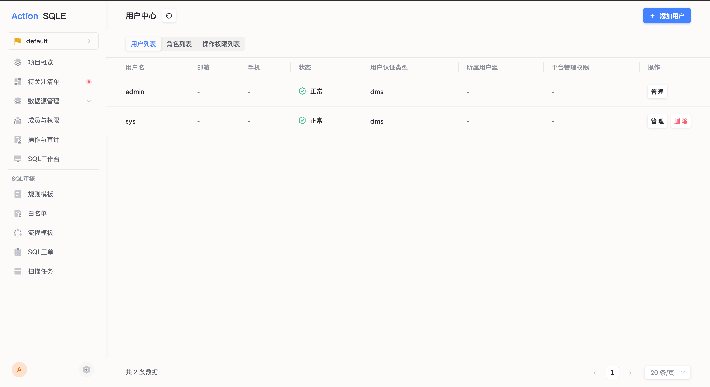

# 用户管理
当需要创建新的用户，或需要由管理员修改用户基本信息时，可以进行用户管理的相关操作。

### 操作步骤
* 点击顶部导航栏`更多`按钮，点击平台管理栏目下的`用户中心`选项，查看用户管理标签。
* 点击列表右上角`创建用户`按钮，填写用户相关信息:
    * 用户名
    * 密码
    * 确认密码
    * 邮箱：若开启邮件推送或飞书推送服务，则将会以邮件形式通知对应用户工单的流转状态
    * 微信ID：若开启企业微信推送服务，则将通过企业微信通知对应用户工单的流转状态
    * 平台管理权限：当前可选项为创建项目，若选择该权限，则该用户将具有创建项目的权限

* 点击提交，完成用户创建

### 执行结果
创建成功后，可在用户列表中查看已创建的用户信息

### 后续步骤
* 添加项目成员：项目管理员可进入指定项目，将创建的用户添加为项目成员，可参考[成员/成员组管理](../project/group_member.md)。

### 更多操作
* 编辑用户：其中，用户名不可更改，其他信息项均可更改。
* 删除用户
* 修改用户密码：点击用户列表的`更多`按钮，下拉菜单中点击`更修改该用户密码`。
:::tip
管理员还可以对指定的用户进行`禁用`或者`启用`。 当用户被管理员禁用后，该用户将无法登录，也无法进行任何操作。 管理员用户永远无法禁用自己本身。
:::

